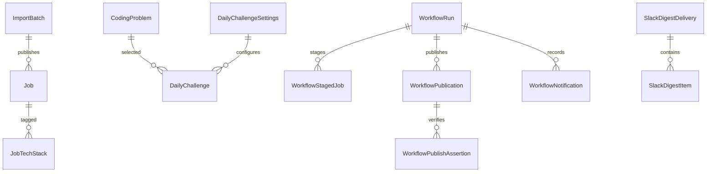

# 데이터 모델

운영 Sites/D1 정의는 `db/schema.ts`, 순방향 migration은 `drizzle/`이 단일 진실 공급원이다. 별도 ORM schema나 PostgreSQL 모델은 두지 않는다.

공개 런타임이 읽는 데이터는 `jobs`, `job_tech_stacks`, `coding_problems`, `daily_challenges`, `daily_challenge_settings`다. 내부 게시·발송 경로는 `import_batches`, `workflow_*`, `slack_digest_*` 원장만 사용한다. 시간은 ISO 8601 UTC text로 저장하고 오늘의 문제 날짜는 `YYYY-MM-DD` KST calendar date를 사용한다.

무결성 예:

- 채용 `canonical_key`, 원본 URL과 fingerprint unique: 같은 공고 중복 게시 방지
- 오늘의 문제 `(kst_date, level_slot)` unique: 같은 슬롯 중복 선택 방지
- Slack delivery idempotency key unique: 같은 일자의 메시지 중복 전송 방지
- workflow run/publication key unique: 동일 검증 결과 재게시 방지
- import batch checksum unique: 동일 입력 재반영 방지

과거 migration으로 생성된 사용자·학습·컬렉션·풀이·알림 테이블은 기존 운영 데이터의 비파괴 보존을 위해 물리적으로 남아 있을 수 있다. 현재 Worker의 라우터·스키마 readiness·쿼리에는 포함되지 않으며 새 API에서 접근할 수 없다. 별도 데이터 폐기 정책이 승인되기 전에는 API 제거를 이유로 파괴적 migration을 만들지 않는다.
