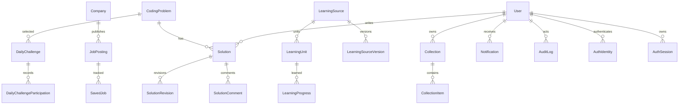

# 데이터 모델

운영 Sites/D1 정의는 `db/schema.ts`, 순방향 migration은 `drizzle/`이 단일 진실 공급원이다. 별도 ORM schema나 PostgreSQL 모델은 두지 않는다.

주요 식별자는 UUID다. 시간은 ISO 8601 UTC text로 저장하며 `DailyChallenge.kstDate`만 `YYYY-MM-DD` KST calendar date 의미를 갖는다. soft delete가 필요한 사용자 소유 콘텐츠에는 `deletedAt`이 있다.

무결성 예:

- `DailyChallenge.kstDate` unique: 하루 한 문제
- `CollectionItem(collectionId,itemType,targetId)` unique: 폴더 안 중복 방지
- `ProblemProgress(userId,problemId)` unique: 사용자별 문제 상태 하나
- `SolutionRevision(solutionId,revision)` unique: revision 순서
- `SavedJob(userId,jobId)` unique: 사용자별 지원 상태 하나
- `JobImportBatch.checksum` unique: 동일 import idempotency
- `LearningSourceVersion.sha256` unique: 동일 파일 중복 감지
- `AuthIdentity(provider,providerSubject)` unique: Google `sub` 중복 연결 방지
- `AuthSession.tokenHash` unique: 원문 세션 토큰을 DB에 저장하지 않고 세션 중복 방지

폴더 cycle과 2단계 UI 정책, 댓글 한 단계 답글, SOLVED 코드 필수, career-only 거절은 DB constraint만으로 표현하기 어려워 domain service와 unit test로 방어한다.
