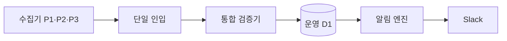

# 채용공고 수집·게시·알림 파이프라인

CareerGround의 운영 흐름은 다섯 경계로 본다. 각 경계 내부의 세부 원장은 장애 복구용으로 유지하지만,
운영자가 따라야 할 정상 경로는 아래 한 줄이다.

## 경계별 책임

| 경계      | 입력                       | 한 가지 책임                                      | 실패 시 동작                          |
| --------- | -------------------------- | ------------------------------------------------- | ------------------------------------- |
| 수집      | 담당 공식 출처             | 신규 후보 delta 생성                              | 해당 파티션을 성공으로 표시 안 함     |
| 인입      | 세 Git blob과 Issue 포인터 | 날짜·attempt·출처 소유권이 같은 묶음 완성         | 세 파티션이 모일 때까지 대기          |
| 통합 검증 | schema 5.1 후보            | enum 정규화, 정책 검사, URL·fingerprint 중복 검사 | 전체 묶음을 fail-closed               |
| 게시      | 정규화된 publish request   | 운영 기준선 대조 후 신규 ACTIVE만 원자 반영       | 기존 jobs와 saved_jobs 불변           |
| 알림      | D1 신규 공고와 오늘의 문제 | 08:01 목표 메시지를 정확히 한 번 전송             | 08:31·이벤트 감시가 같은 claim 재확인 |

## 유지하는 안전장치

- 수집기 alias는 통합 검증기에서만 canonical enum으로 바꾼다. 보호된 게시 API는 alias를 다시
  받아들이지 않아 인입 검증 우회를 막는다.
- `id`, canonical URL, canonical job key, fingerprint 충돌은 자동 병합하지 않는다.
- 게시 원장은 staging과 publication 완료를 분리하며 기존 `jobs` UPDATE·DELETE 및 `saved_jobs`
  mutation을 허용하지 않는다.
- Slack은 `daily:YYYY-MM-DD`를 D1에서 원자 claim한다. `SENT`는 재전송하지 않고 `UNCERTAIN`은
  자동 재시도를 막는다.
- 예약 트리거는 07:55 선점 후 08:01 실행과 08:31 감시 두 개뿐이다. 게시 완료와 Production SLO
  완료 이벤트는 예약 누락을 보완하지만 같은 claim을 사용한다.

구현 기준은 `scripts/jobs-v5/canonical-policy.mjs`, `scripts/jobs-v5/discovery-delta.mjs`,
`deployment/sites/d1-jobs-v5-discovery-contract.ts`, `.github/workflows/careerground-v5-handoff.yml`,
`.github/workflows/daily-slack-digest.yml`이다.
