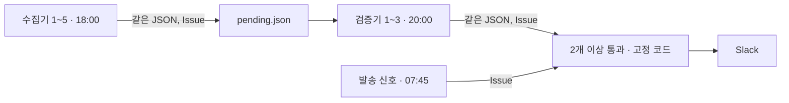
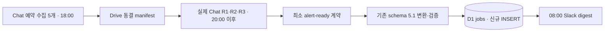

# 채용공고 수집·검증·알림 파이프라인

## 전환 중인 경로

```mermaid
flowchart LR
  C[수집기 1~5 · 18:00] -->|같은 JSON, Issue| P[pending.json]
  P --> R[검증기 1~3 · 20:00]
  R -->|같은 JSON, Issue| F[2개 이상 통과 · 고정 코드]
  S[발송 신호 · 07:45] -->|Issue| F
  F --> N[Slack]
```

수집기, 검증기, 최종 결과가 한 가지 JSON 형식을 쓴다. 형식이 틀린 공고는 그 공고만 빠진다. 검증은 전날 저녁에 끝내고, 아침 07:45 발송 신호 Issue가 도착하면 바로 발송한다. cron은 보조로만 쓴다. CareerGround DB, HQ, Drive를 거치지 않는다. 자세한 내용은 [`job-alert-direct-pipeline.md`](../operations/job-alert-direct-pipeline.md)에 있다.

## 기존 경로 (전환 전까지)

```mermaid
flowchart LR
  C[Chat 예약 수집 5개 · 18:00] --> M[Drive 동결 manifest]
  M --> R[실제 Chat R1·R2·R3 · 20:00 이후]
  R --> A[최소 alert-ready 계약]
  A --> V[기존 schema 5.1 변환·검증]
  V --> D[(D1 jobs · 신규 INSERT)]
  D --> N[08:00 Slack digest]
```

수집 원본과 독립 검증을 Drive에 남기고, `PASS` 교집합만 결정적 변환한다. 변환 파일 3개는 같은 attempt와 bundleId로 묶인다. GitHub Issue 포인터와 blob이 일치하고 운영 validator를 통과하면 신규 `ACTIVE` 공고만 DB에 반영한다. 기존 행은 삭제·수정하지 않으며 `job_alert_candidates` view로 과거와 신규 공고를 같은 최소 필드로 읽는다.

Slack은 직전 성공 알림 이후 채용 import가 `COMMITTED`인지 먼저 확인한다. 07:55 선점 runner는 08:00까지 대기하고, 08:30 감시 및 게시 완료 이벤트가 지연을 재확인한다. 모두 하나의 `daily:YYYY-MM-DD` 원자 claim과 공고별 예약 원장을 공유한다. `SENT`는 다시 보내지 않고 `CLAIMED/UNCERTAIN`은 추정 재시도하지 않는다. 기존 공휴일 차단도 유지한다.

최소 데이터 필드와 실행 불변식은 [`job-alert-ready-contract.md`](../operations/job-alert-ready-contract.md)를 따른다. 주요 구현은 `scripts/jobs-v5/alert-ready.mjs`, `scripts/jobs-v5/handoff.mjs`, `scripts/jobs-v5/discovery-delta.mjs`, `deployment/sites/d1-daily-challenges.ts`, `.github/workflows/daily-slack-digest.yml`이다.
