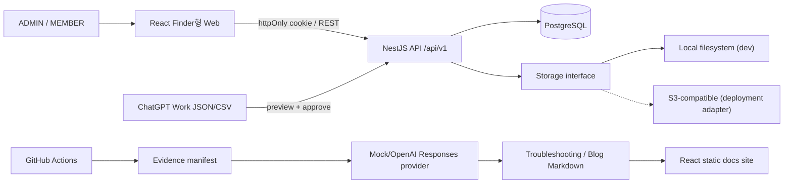
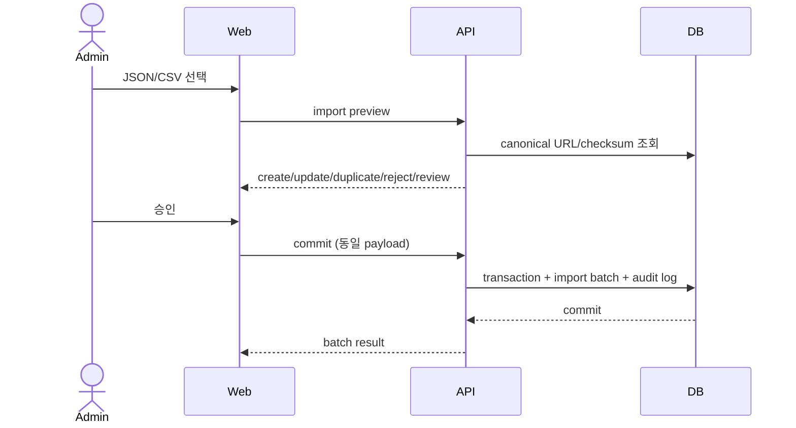

# 시스템 개요

CareerGround는 React 웹, Nest REST API, PostgreSQL, 정적 문서 사이트로 구성된다. 외부 수집은 애플리케이션 밖에서 이루어지고 ADMIN이 정형 파일을 승인한다.

## 경계

- 브라우저는 access/refresh token을 읽을 수 없다. 두 token은 `httpOnly` cookie다.
- API만 DB, storage, OpenAI key에 접근한다.
- 채용 사이트와 프로그래머스 페이지를 요청하거나 파싱하는 코드가 없다.
- import 승인은 checksum과 batch report를 남기는 DB transaction이다.
- Redis 없이 PostgreSQL unique constraint와 idempotency key를 사용한다.

## 주요 흐름

오늘의 문제는 KST calendar date unique constraint를 최종 동시성 방어선으로 사용한다. 같은 seed와 후보 집합은 같은 문제를 고르며, 후보가 없으면 범위를 몰래 넓히지 않고 ADMIN 알림을 만든다.
