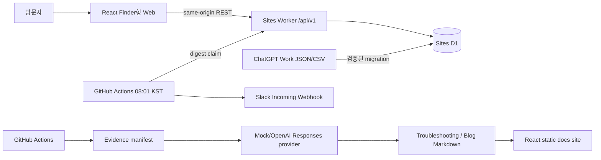
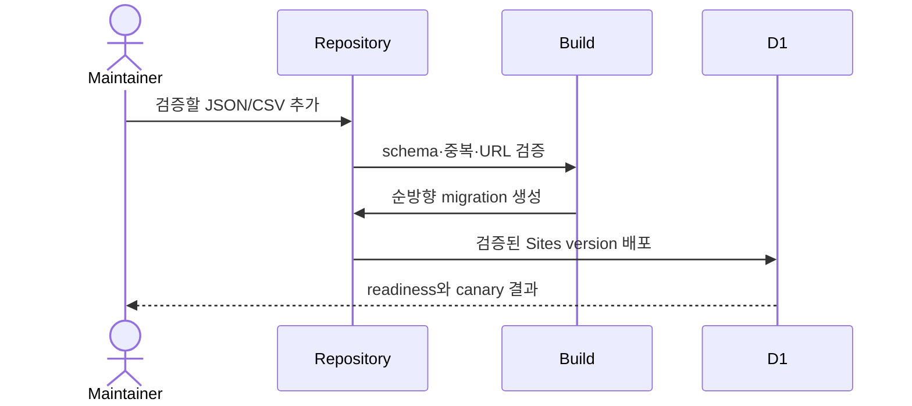

# 시스템 개요

CareerGround는 로그인 없는 React 웹, Sites Worker 읽기 API, D1과 정적 문서 사이트로 구성된다. 외부 수집과 검증은 애플리케이션 밖의 저장소 작업으로 이루어진다.

## 경계

- 운영과 로컬 E2E는 같은 Worker/D1 공개 조회 handler를 사용한다.
- Worker만 D1에 접근하며 브라우저에는 계정 쿠키를 발급하지 않는다.
- 즐겨찾기는 서버 개인 데이터 대신 현재 브라우저 저장소를 사용한다.
- 채용 사이트와 프로그래머스 페이지를 요청하거나 파싱하는 코드가 없다.
- import 승인은 checksum과 batch report를 남기는 D1 batch다.
- 별도 queue나 Redis 없이 D1 unique index, compare-and-swap, lease와 idempotency key를 사용한다.
- 공개·내부 endpoint의 전체 허용 목록은 [운영 API 표면](api-surface.md)에 고정한다.

## 웹 모듈 경계

- `pages`는 route 상태, query와 mutation orchestration을 소유한다.
- 기능별 순수 계산과 표시 제어는 `features/<domain>`에 둔다. 채용은 `features/jobs`가 날짜·필터
  domain과 필터·상세 dialog를 소유한다.
- `styles.css`는 전역 cascade 순서를 고정하는 import manifest이며 실제 규칙은 `styles`의 기능별
  파일에 둔다. 구조 테스트가 route 900줄, CSS module 3,500줄 한도를 막는다.
- 화면 동작을 바꾸지 않는 CSS 분리는 연결한 원문의 checksum과 브라우저 회귀로 검증한다.

## 주요 흐름

오늘의 문제는 KST calendar date와 level slot unique constraint를 최종 동시성 방어선으로 사용한다. 같은 날짜와 후보 집합은 같은 문제를 고르며, 후보가 없으면 범위를 몰래 넓히지 않고 명시적 오류를 반환한다.
