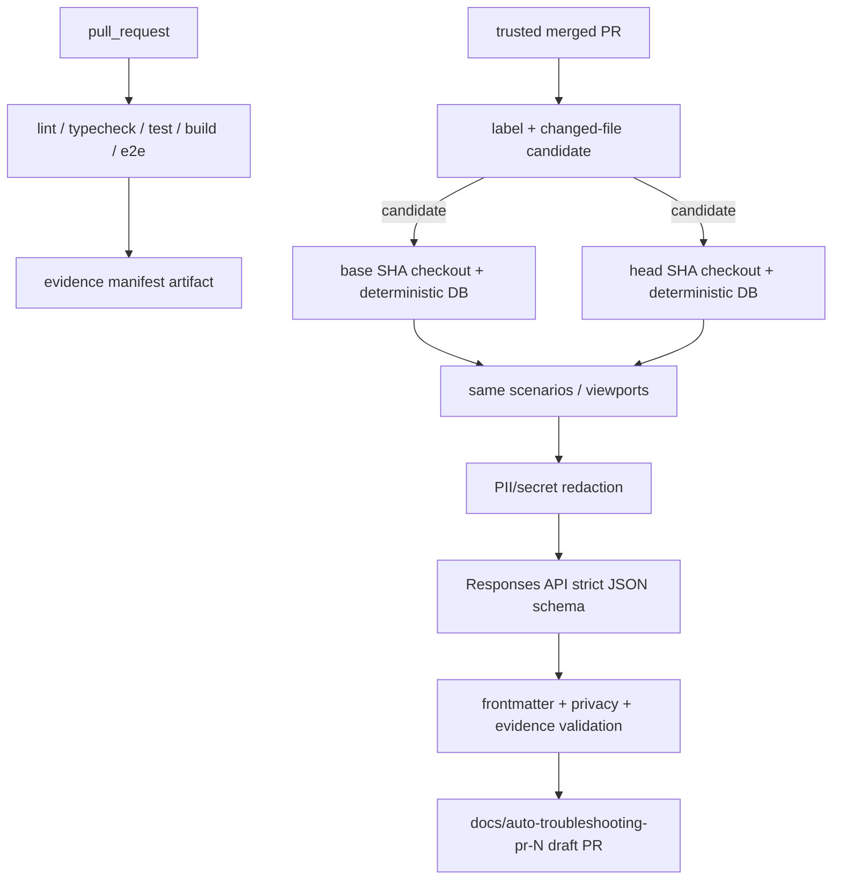

# 트러블슈팅 자동화

PR CI는 secret 없이 test/build/Playwright와 evidence artifact를 만든다. AI 문서 workflow는 같은 저장소 PR이 merge된 뒤에만 `OPENAI_API_KEY`를 사용한다.

후보는 `fix`, `perf`, 의미 있는 `refactor`/`feat`다. `skip-ai-doc`, `no-public-doc`, `force-ai-doc` 라벨이 우선한다. `no-public-doc`은 기술 문서만 만든다.

명령과 출력 경로는 README를 따른다. benchmark가 관련 없거나 수집되지 않으면 `정량 측정 불가`를 사용한다. screenshot은 1440×900, 375×812를 기본으로 하고 WebP 최적화 후 `docs/assets/troubleshooting/<pr>`에 둔다.

OpenAI provider는 공식 Responses API `text.format` strict JSON schema를 사용한다. refusal, incomplete, output_text 누락은 실패이며 문서 PR을 만들지 않는다. unit test는 deterministic mock만 사용한다.
