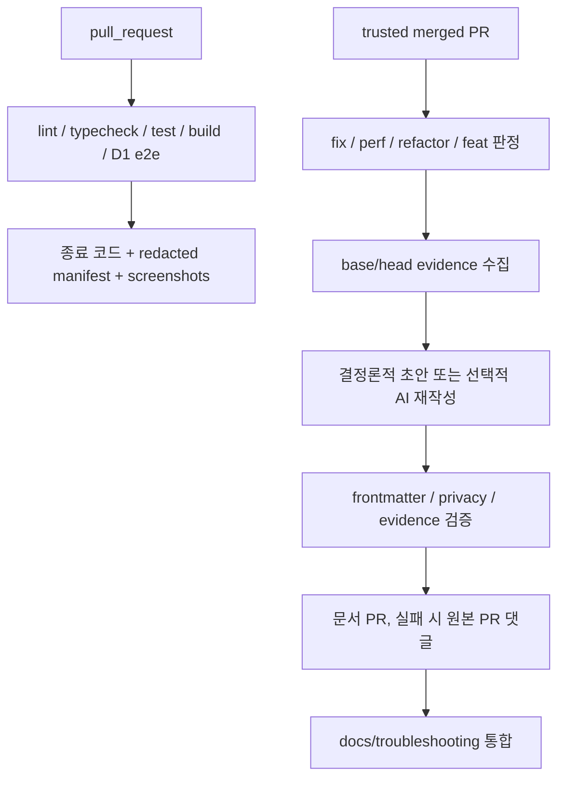

# 트러블슈팅 자동화

트러블슈팅의 기준 자료는 PR 댓글이 아니라 `docs/troubleshooting/*.md`와 `docs/evidence/**`다. PR CI는 secret 없이 검증 로그·manifest·Playwright artifact를 만들고, 문서 생성기는 결정론적 fallback만으로도 기술 기록을 남긴다.

## 자격증명 정책

`OPENAI_API_KEY`와 `OPENAI_TROUBLESHOOTING_MODEL`은 문장을 선택적으로 재구성할 때만 사용한다. 없으면 `--provider mock`이 동일 evidence에서 결정론적 기록을 만든다. 코드 수정 과정, 종료 코드, benchmark, screenshot을 저장하는 데 API key가 필요하지 않다.

외부 fork PR에서는 secret을 읽지 않는다. AI workflow는 같은 저장소에서 merge된 신뢰 PR에만 실행한다. `skip-ai-doc`, `no-public-doc`, `force-ai-doc` 라벨이 후보 판정보다 우선한다.

## 증거 판정 규칙

- 성공/실패는 로그 안의 단어가 아니라 **마지막 명시적 `exit code`**로 판정한다.
- `12 passed`가 있어도 마지막 코드가 `1`이면 실패다.
- benchmark가 없거나 비교 조건이 다르면 `정량 측정 불가`라고 쓴다.
- 성능 수치는 동일 fixture·동일 명령·동일 측정 구간의 median/p95를 함께 남긴다.
- screenshot은 기본 1440×900과 375×812이며 WebP로 최적화해 `docs/assets/troubleshooting/<case>`에 둔다.
- secret, cookie, 인증 헤더, 이메일 등 식별 정보는 artifact 업로드 전에 제거한다.

수집기 회귀 테스트는 `scripts/troubleshooting/collect-evidence.test.ts`에 있으며, 잘못된 성공 판정을 재현하는 표본을 고정한다. 과거 PR artifact의 보존 manifest는 `docs/evidence/archive/pr-*-manifest.json`에서 확인한다.

## 문서 완료 조건

각 사건 문서는 증상, 영향 범위, 핵심 이론, 원인, 전/후 코드 또는 화면, 정량 결과, 회귀 테스트, 남은 위험을 포함한다. 단순 변경 목록이나 PR 링크만 있는 문서는 완료로 보지 않는다. 전체 색인은 `docs/troubleshooting/README.md`에서 관리한다.
