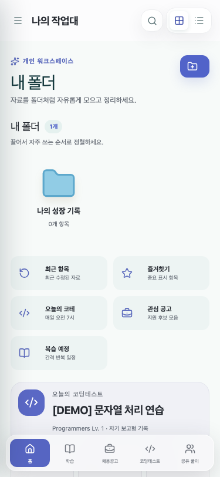

# 초기 MVP와 정적 Sites 배포 경계

## 현상과 영향

PR #3은 빈 저장소에서 pnpm 모노레포, PostgreSQL/Nest API, React UI와 테스트를 구축했다. 다만 최초 Sites 배포는 웹 정적 자산만 제공했고 별도 API의 `API_ORIGIN`과 인증 자격증명이 없었다. 따라서 창과 화면은 보였지만 데이터 기능은 운영 가능한 상태가 아니었다. 이 경계가 이후 4xx/5xx 장애의 출발점이었다.

## 핵심 이론

배포 성공은 애플리케이션 준비 완료와 동의어가 아니다. 정적 자산의 200 응답, 인증 경계, 데이터 저장소 readiness를 각각 확인해야 한다. 특히 프런트엔드와 API를 분리한 구조에서는 `index.html`이 정상이어도 데이터 요청은 실패할 수 있다.

```text
브라우저 ──200──> Sites 정적 자산
브라우저 ──503──> /api/v1/* (API_ORIGIN/DB 없음)
```

## 구현과 전후 비교

- 이전: 빈 저장소, 실행·검증 경로 없음.
- 이후: 7개 workspace, 2개 초기 migration, seed, CI, Playwright, 문서 사이트 구성.
- 남은 경계: Sites의 웹 산출물과 별도 Nest/PostgreSQL 사이 연결은 구성되지 않음.

초기 데스크톱/모바일 레이아웃 증빙:




## 수치와 검증

PR 본문과 커밋된 manifest가 기록한 동일 시점 결과다.

| 항목             | 결과                         |
| ---------------- | ---------------------------- |
| 단위 테스트      | 39개 통과                    |
| Playwright E2E   | 12/12 통과                   |
| 시각·접근성 E2E  | 2/2 통과, serious/critical 0 |
| 의존성 감사      | 알려진 high 취약점 0         |
| production build | API/web/docs 통과            |

운영 데이터 endpoint의 성공률과 지연 시간은 당시 측정되지 않아 `정량 측정 불가`다.

## 회귀 방지와 교훈

- 배포 체크리스트에서 정적 200과 `/api/v1/health/ready`를 분리한다.
- 저장소·migration이 연결되지 않은 상태를 UI 성공으로 간주하지 않는다.
- Sites 운영 경로는 이후 PR #7에서 D1로 완결했고, 현재는 D1만 canonical write path로 사용한다.

## 근거

- [PR #3](https://github.com/edder773/careerground/pull/3)
- `docs/evidence/3/manifest.json`
- 후속 상세 원인: [운영 4xx/5xx와 D1 전환](./2026-08-12-production-api-errors-and-d1-persistence.md)
