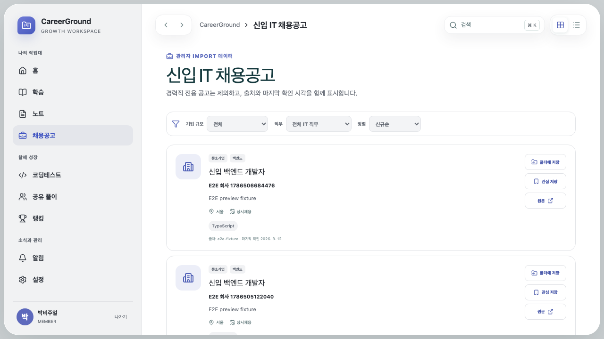

# 채용 달력과 D1 조회 성능 개선

## 현상

채용공고 목록만으로는 회사별 마감 일정을 월 단위로 훑기 어려웠다. 기존 D1 latest-first query는 모든 job column을 읽고 전체 scan 뒤 temporary B-tree로 정렬했다. 학습 목록은 unit별 추가 쿼리가 반복되는 N+1 형태였다.

## 핵심 이론

- 읽기 모델은 화면이 사용하는 column만 projection한다.
- 범위 조회는 `deadline`, `collected`, `created`의 검색 조건과 정렬 순서에 맞는 index를 사용한다.
- N+1은 parent 목록을 읽은 뒤 child를 parent 수만큼 읽는 구조다. child를 `IN (...)` 또는 고정된 bulk query로 읽고 메모리에서 그룹화하면 query 수가 데이터 크기와 분리된다.
- 합성 로컬 DB 수치는 production network latency와 분리해 해석한다.

## 쿼리 전후

```diff
- SCAN jobs
- USE TEMP B-TREE FOR ORDER BY
+ SCAN jobs USING INDEX idx_jobs_created_status
+ 화면에 필요한 필드만 SELECT
```

```diff
- learning source 1회 + unit마다 flashcard/question 조회
+ source/unit/flashcard/question 4개 bulk catalog query
```

## 정량 결과

50,000개 합성 job, 같은 Node `node:sqlite`, 100회, 100-row limit 조건이다.

| query       |    median |       p95 |                           변화 |
| ----------- | --------: | --------: | -----------------------------: |
| 기준        | 20.153 ms | 21.329 ms |                              - |
| 인덱스 적용 |  0.137 ms |  0.196 ms | median 99.32% 감소, 약 147.1배 |

후속 calendar range benchmark는 동일 50,000개 데이터, 50회 조건에서 median `0.807 → 0.559 ms`(30.73% 감소), p95 `0.936 → 0.707 ms`(24.47% 감소)였다. D1 learning endpoint의 observed prepare count는 `21 → 11`(47.62% 감소), catalog portion은 데이터 수와 무관한 4개 bulk query가 됐다.

이 수치는 로컬 쿼리 경로만 나타내며 운영 DB·네트워크 latency를 주장하지 않는다.

## UX 결과

- 회사명이 표시되는 월별 달력과 기간별 query 추가.
- 시작/마감/상시를 분리하고 상세는 modal로 표시.
- 상시 채용 전용 modal과 날짜 overflow `+N` 확장.
- company size/job category 복수 필터와 source 강조.
- 1분 client cache, focus refetch 비활성화.

초기 목록 화면 참고:



## 회귀 방지

- `scripts/performance/benchmark-jobs-query.mjs`로 같은 seed/iteration을 재실행한다.
- query plan에 temporary sort가 다시 등장하는지 검사한다.
- D1 integration에서 calendar range와 multi-value filter를 검증한다.
- 1440×900/375×812 달력·modal E2E와 axe 검사를 유지한다.

## 근거

- [PR #11](https://github.com/edder773/careerground/pull/11)
- [PR #13](https://github.com/edder773/careerground/pull/13)
- `docs/evidence/jobs-query-performance.json`
