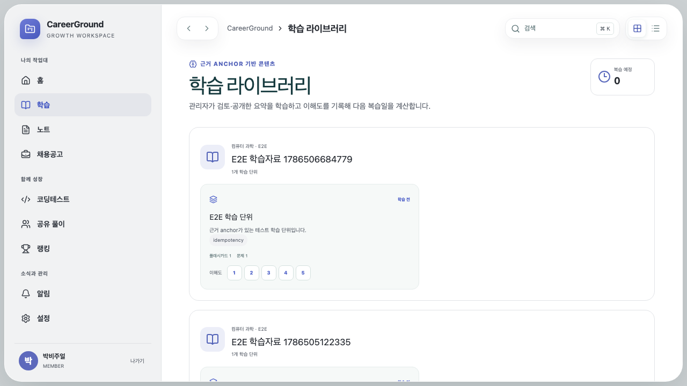

# 학습·설정 단순화와 SQL/PDF 시각자료 분리

## 현상

학습 카드의 별도 시작/이해도 단계, 미완성 AI upload 처리, 데이터 내보내기/삭제 요청은 실제 제품 흐름에 필요하지 않았다. Programmers SQL 문제가 algorithm과 섞였고 학습 요약은 PDF의 그림·코드 맥락을 전달하지 못했다. 긴 학습 라이브러리는 접기 없이 화면을 차지했다.

## 핵심 이론

분류는 제목 휴리스틱만이 아니라 source catalog의 lesson identity로 migration해야 재실행 가능하다. 원본 교육 시각자료는 저작권·출처를 보존하며 필요한 page capture만 연결하고, 재구성한 설명과 원문 capture의 역할을 구분한다. 설정은 read-only 상태와 명시적 변경 mode를 분리해 사용자가 현재 저장 상태를 이해하게 한다.

## 데이터 전후

| 항목            |             이전 |                                  이후 |
| --------------- | ---------------: | ------------------------------------: |
| 문제 catalog    |       혼합 427개 |                algorithm 365 + SQL 62 |
| 오늘의 문제     | algorithm Lv.1/2 |         algorithm Lv.1/2 + SQL Lv.3–4 |
| 학습 시각자료   |                0 | 4개 PDF에서 선별한 23개 slide capture |
| 추가 학습 unit  |        기존 과정 |            3 package, 총 17 unit 추가 |
| ranking opt-out |             가능 |    active member 자동 참여, 0 opt-out |

```diff
- 학습 시작 / 이해도 / 학습 전
+ 카드 클릭 즉시 lesson dialog + library 접기

- AI 학습 upload/status, export/delete request
+ 구조화 package import만 유지

- 설정 form 상시 편집 + 설정 저장
+ read-only -> 변경 -> 저장/취소
```

초기 학습 화면 참고:



## 검증

- PR #14: 68 tests, 14 Chromium E2E, PostgreSQL에서 신규 unit 17개와 ranking opt-out 0 확인.
- PR #15: 71 tests(contracts 8/API 32/web 14/Sites+troubleshooting 17), Playwright 14개.
- 1440×900, 1024×768, 375×812, 320×568 및 axe serious/critical 0.
- PostgreSQL/D1 migration과 seed, production/Sites build 통과.

사용자가 학습 내용을 이해하는 데 걸린 시간은 별도 연구가 없어 `정량 측정 불가`다.

## 회귀 방지

- catalog 분류 합계가 427이며 SQL 62/algorithm 365인지 검사한다.
- 오늘의 challenge가 track/level slot별로 한 개씩 존재하는지 검사한다.
- 모든 learning unit의 source visual path가 실제 정적 asset으로 build되는지 검사한다.
- 설정은 변경 전 input이 read-only이고 취소 시 원래 값으로 돌아오는지 검증한다.

## 근거

- [PR #14](https://github.com/edder773/careerground/pull/14)
- [PR #15](https://github.com/edder773/careerground/pull/15)
