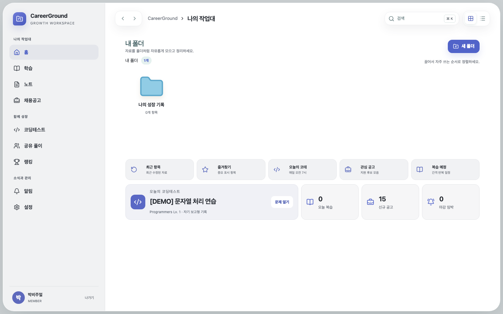
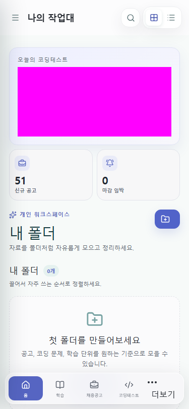

# 잔여 감사 49개를 데이터 무결성부터 운영 게이트까지 닫은 과정

## 문제와 영향

131개 감사의 첫 조치 뒤에도 기술 미해결 46개와 운영 검증 대기 3개가 남아 있었다. 대표 위험은 다음과 같았다.

- DB가 사용자 소유 행과 상위 행의 관계를 애플리케이션 검사에만 의존했고, TEXT 상태값에 전면 CHECK가 없었다.
- 채용 import가 현재 package만 반영해 원본에서 사라진 공고를 판정하지 못했다.
- 풀이·채용·학습 목록이 상세 본문까지 반환했고, 검색은 bounded `LIKE`라 cursor가 없었다.
- 복습 동시 요청, 알림 scheduler 중복 실행, 문제 진행과 풀이 저장의 부분 성공 가능성이 있었다.
- 폴더 저장·revision conflict·학습 문항·알림 filter가 끝까지 연결된 사용자 흐름이 아니었다.
- 성능, 복구, pixel, 200% reflow가 재현 가능한 release gate가 아니었다.

이 작업은 UI를 먼저 덧붙이지 않고 `migration → D1 API → UI → unit/integration → browser → 운영 HTTP` 순서로 같은 vertical slice를 완결했다.

### 운영 배포에서만 드러난 스키마 불일치

PR #22 배포 뒤 실제 브라우저에서 `백엔드`를 검색하자 `GET /api/v1/search`가 500을 반환했다. Worker 로그의 request id `adf16096-3ce0-4e48-9d88-3e7f7b6f622d`는 905 ms 뒤 `no such table: workspace_search`로 종료됐다. 운영 D1 overview에는 기존 26개 user table만 있었고, migration 0013의 additive table 6개와 migration 0014의 FTS table이 없었다. 즉 로컬 migration과 새 배포 artifact는 정상이었지만 Sites 배포가 저장된 SQL 파일을 운영 D1에 자동 적용한다고 가정한 것이 원인이었다.

해결은 기존 운영 데이터를 버리고 seed를 다시 넣는 방식이 아니라, Sites 권장 경로인 prepared statement 기반 runtime initialization으로 만들었다. 첫 API 요청과 scheduled handler가 `ensureRuntimeSchema()`를 공유하며 다음을 순서대로 수행한다.

1. source snapshot, 정규화 tech stack, 학습 답안·복습 event, scheduler lease table을 `IF NOT EXISTS`로 생성한다.
2. 구형 `learning_progress`에 `review_version`, `completed_at`, `mastered_at`만 additive ALTER로 보강한다.
3. FTS5 table과 18개 동기화 trigger를 만든다.
4. 기존 공통 데이터와 사용자 소유 데이터를 `NOT EXISTS` 조건으로 한 번만 backfill한다.

```diff
 async function serveApi(request, env) {
-  return handleD1Api(request, env)
+  await ensureRuntimeSchema(env.DB)
+  return handleD1Api(request, env)
 }
```

동시 cold start에도 재실행 가능하도록 모든 DDL과 backfill을 멱등하게 만들고, DB binding별 Promise를 공유해 같은 isolate 안의 중복 초기화를 제거했다. 회귀 테스트는 최신 DB를 의도적으로 운영의 구형 shape로 되돌린 뒤 6개 table, 3개 column, FTS backfill을 복구하고 두 번째 실행에서 검색 row count가 늘지 않는지 검증한다.

버전 24 배포 후 readiness 첫 호출은 174 ms에 200을 반환했고, 운영 overview는 26개에서 FTS를 포함한 33개 table로 증가했다. 같은 검색은 더 이상 500으로 종료되지 않고 1,069 ms에 200을 반환했으며, `백엔드 개발` 검색에서 기존 Hudson AI 공고 1건이 UI listbox에 표시됐다. 이 시간은 Worker 전체 요청 시간이고 로컬 FTS 자체 p95 1.27 ms와 구분한다.

### 200 응답도 계약이 다르면 실패다

검색 복구 뒤 홈을 반복 새로고침하자 HTTP 로그는 모두 200인데도 전역 live region에 `INVALID_API_RESPONSE`가 표시됐다. 운영 사용자에게 삭제된 폴더 2개가 있었고, `/collections/trash`는 활성 폴더와 달리 `items` 필드를 생략했다. 빈 fixture만 사용한 화면 테스트와 `objectContaining(id, name)`만 검사한 D1 테스트가 이 차이를 놓쳤다.

```diff
- return trashedFolders
+ return trashedFolders.map(folder => ({ ...folder, items: [] }))
```

복원 목록은 삭제된 폴더의 내부 항목을 표시하지 않으므로 빈 배열을 명시해 공통 Collection DTO를 유지했다. 회귀 테스트도 삭제된 폴더의 `items: []`까지 검사하도록 강화했다. 이 조치는 “HTTP 200”을 성공 기준으로 삼지 않고 runtime schema까지 통과해야 성공이라는 원칙을 운영 데이터로 확인한 사례다.

## 핵심 이론 1: 무결성은 DB 제약과 authoritative snapshot에서 끝난다

### FK와 CHECK는 마지막 방어선이다

서버의 Zod 검사는 잘못된 요청을 빠르게 설명하지만, 재시도·동시 실행·새로운 쓰기 경로까지 영구적으로 통제하지 못한다. `drizzle/0013_pretty_proudstar.sql`은 기존 데이터를 보존하는 순방향 table rebuild로 FK와 enum CHECK를 추가했다. collection item의 다형 target처럼 SQLite FK로 표현할 수 없는 관계만 API validator에 남겼다.

```diff
- item_type TEXT NOT NULL
+ item_type TEXT NOT NULL
+ CHECK (item_type IN (
+   'JOB_POSTING', 'CODING_PROBLEM', 'SOLUTION',
+   'LEARNING_UNIT', 'NOTE', 'EXTERNAL_LINK'
+ ))
+ FOREIGN KEY (collection_id) REFERENCES collections(id) ON DELETE CASCADE
```

`pnpm db:d1:generate`를 다시 실행해 `No schema changes, nothing to migrate`를 확인했다. migration metadata와 실제 schema가 어긋나 중복 migration이 생성되는 문제도 0013 snapshot의 `EXTERNAL_LINK` CHECK를 실제 SQL과 맞춰 해결했다.

### FULL import는 목록이 아니라 시점별 진실이다

채용 source마다 `FULL` 또는 `PARTIAL` snapshot을 저장한다. `FULL` package에 더 이상 없는 과거 공고만 같은 transaction에서 `REMOVED`로 전환하고, `PARTIAL` package는 누락을 삭제 신호로 해석하지 않는다.

```text
source snapshot
  ├─ FULL    → 현재 fingerprint 집합 밖의 기존 ACTIVE 공고를 REMOVED
  └─ PARTIAL → upsert만 수행하고 누락 상태는 보존
```

이 경계는 “수집 실패로 빈 package가 왔을 때 전부 삭제”되는 사고를 막는다. D1 회귀 테스트는 FULL snapshot 두 번을 적용해 사라진 행만 제거되는지 검증한다.

## 핵심 이론 2: 목록과 상세를 분리하고, 검색을 indexable하게 만든다

풀이·채용·학습 목록은 카드에 필요한 summary만 반환하고 코드·댓글·긴 본문은 detail endpoint에서 가져온다. 검색은 jobs/problems/learning/solutions/notes를 FTS5 virtual table로 합치고 trigger로 변경을 동기화한다. cursor는 정렬 가능한 `rowid` 위치를 이어 받아 같은 결과의 중복·누락을 막는다.

```diff
- SELECT title, summary, code, comments, revisions ... LIMIT 200
+ SELECT id, title, author, counts ... LIMIT :pageSizePlusOne
+ GET /solutions/:id  // code, comments, revisions는 선택 시 로드

- WHERE title LIKE '%' || :query || '%'
+ WHERE workspace_search MATCH :prefixAndQuery
+   AND rowid > :cursorRowId
+ ORDER BY rowid
```

목록/detail 분리는 단순 payload 최적화가 아니라 접근 제어와 schema evolution의 경계도 작게 만든다. 웹은 주요 GET 응답에 semantic Zod schema를 적용하고, 형식이 다르면 잘못된 화면을 계속 그리지 않고 `INVALID_API_RESPONSE`로 중단한다.

## 핵심 이론 3: 동시성은 CAS·lease·원자 endpoint로 다룬다

- 학습 복습은 `review_version` compare-and-swap으로 stale client를 `409` 처리하고 event sequence를 별도 저장한다.
- scheduler는 DB lease를 먼저 획득해 같은 구간의 중복 실행을 막고, 알림은 dedupe key로 재시도에 안전하게 만든다.
- 문제 진행 상태와 공개 풀이 저장은 `/coding/solutions/complete` 한 transaction에서 처리한다.
- 학습 문항의 정답은 목록/detail에 포함하지 않고 답 제출 뒤에만 공개하며 attempt 이력을 남긴다.

CAS는 충돌을 없애는 기술이 아니라 충돌을 탐지 가능한 상태로 바꾸는 기술이다. UI는 409를 숨기지 않고 기존 revision과 현재 입력의 Myers diff를 보여준 뒤 다시 저장하도록 한다.

## 핵심 이론 4: 접근성 상태는 DOM 의미와 회귀 테스트로 고정한다

공통 API 실패는 `aria-live` status region에 전달하고, 입력 오류는 `aria-invalid`와 `aria-describedby`로 해당 필드에 연결했다. CodeMirror에는 실제 편집 영역의 accessible name을 부여했다. 폴더 선택은 복수 선택 의미에 맞게 `role="checkbox"`와 `aria-checked`를 사용한다.

첫 전체 E2E에서는 개선된 접근성 의미 때문에 과거 locator가 실패했다. 예를 들어 폴더 항목은 시각적으로 button이지만 접근성 tree에서는 checkbox다. 테스트를 CSS나 텍스트 부분 일치가 아니라 최종 의미로 고쳤다.

```diff
- getByRole('button', { name: folderName })
+ getByRole('checkbox', { name: folderName })
+ expect(folderOption).toBeChecked()
```

또 세 브라우저가 같은 계정과 공고를 병렬 저장해 `1개 폴더`라는 고정 count가 1~3으로 변할 수 있었다. 자신의 폴더 option이 checked인지 검증하고, 총 count는 `\d+개`로 확인해 동시 실행에 독립적인 회귀가 되게 했다. 댓글 테스트도 다른 테스트가 먼저 풀이를 만들 것이라는 순서 의존을 제거하고 각 테스트가 자신의 풀이를 생성하도록 바꿨다.

## 수정 전후 수치

아래는 같은 로컬 D1-compatible fixture와 Node 24.19.0/pnpm 11.21.0에서 측정한 합성 회귀 수치다. 운영 네트워크 latency가 아니다.

| 항목                   | 변경 전        | 변경 후           | 변화                          |
| ---------------------- | -------------- | ----------------- | ----------------------------- |
| 풀이 cursor payload    | 20,579 B       | 4,979 B           | 15,600 B, 75.8% 감소          |
| 풀이 cursor DB queries | 9              | 6                 | 33.3% 감소                    |
| 검색 DB queries        | 10             | 5                 | 50.0% 감소                    |
| 검색 payload           | 4,614 B        | 302 B             | 4,312 B, 93.5% 감소           |
| 최종 FTS 검색 p95      | 해당 구현 없음 | 1.24 ms           | budget 150 ms 통과            |
| 학습 이미지 총량       | 2,708,848 B    | 1,285,372 B       | 1,423,476 B, 52.5% 감소       |
| 복구 snapshot/restore  | 실행 증거 없음 | 1.63 ms / 1.39 ms | 315 pages, checksum 일치      |
| 자동 browser 회귀      | 44개           | 48개              | pixel·200%·keyboard 항목 추가 |

최종 endpoint budget은 jobs cursor p95 9.50 ms, coding cursor 1.05 ms, solutions cursor 6.46 ms, notifications 1.39 ms, search 0.99 ms였고 위반은 0건이었다. 이미지 감소율은 같은 23개 JPG를 quality 82 WebP로 변환한 파일 합계다.

복구 drill은 1,290,240 B snapshot의 315 pages를 격리 DB로 복원해 다음을 확인했다.

- `PRAGMA integrity_check`: 전후 모두 `ok`
- foreign key violation: 전후 0
- fixture checksum: 일치
- table count mismatch: 0
- drill 중 mutation 기준 RPO: 0

설치된 Sites 커넥터는 운영 D1 export/restore 명령을 제공하지 않는다. 따라서 위 수치는 운영 데이터를 복사한 복구 RTO가 아니라 application schema와 D1-compatible SQLite recovery path의 실행 증거다.

## 화면 전후와 pixel 기준선

초기 화면과 현재 Finder형 창의 정보 밀도·모바일 reflow는 저장된 스크린샷으로 비교한다.

### 초기 홈



### 현재 홈


로그인과 모바일 shell은 OS별 동일 경로의 pixel baseline으로 커밋했다.




375×812 viewport를 375×500으로 줄여 가상 키보드가 열린 상황을 모사했고 코드 저장 버튼 접근과 가로 overflow 0을 확인했다. 720×450 viewport에서는 200% 확대에 해당하는 reflow와 serious axe violation 0을 검증했다.

## 최종 검증

| 검증                      | 결과                                      |
| ------------------------- | ----------------------------------------- |
| `pnpm format:check`       | 최종 commit 전 재검증                     |
| `pnpm lint`               | 통과                                      |
| `pnpm typecheck`          | 통과                                      |
| `pnpm test`               | 97/97 통과                                |
| `pnpm test:e2e`           | 48/48 통과, 4 Playwright projects         |
| `pnpm build`              | API/web/docs production build 통과        |
| `pnpm sites:build`        | D1 Worker + static artifact build 통과    |
| `pnpm performance:budget` | 5개 endpoint budget 위반 0                |
| `pnpm recovery:drill`     | integrity/FK/count/checksum 모두 통과     |
| 운영 readiness            | `/api/v1/health/ready` 200, database `d1` |
| 운영 auth boundary        | 무헤더 `/api/v1/auth/me` 401              |

## 남아 있는 외부 검증 경계

131개 중 127개를 코드·자동 검증·운영 HTTP 검증으로 닫았다. 아래 4개는 완료로 과장하지 않았다.

1. A-09/O-05: Sites 커넥터가 운영 D1 export/restore operation을 제공하지 않는다. local executable drill과 runbook은 완료했다.
2. P-13: lease와 dedupe를 포함한 Worker `scheduled()` handler는 구현·테스트했으나 Sites connector에서 cron 등록을 노출하지 않는다.
3. X-10: axe, keyboard, 200% reflow, 모바일 keyboard emulation은 통과했지만 실제 NVDA/VoiceOver/Android/iOS 장비는 현재 환경에 없다.

외부 기능이 제공되면 `docs/operations/backup-restore.md`와 `docs/operations/accessibility-release-checklist.md`의 체크리스트로 재검증한다. 이 제한은 제품 오류를 성공으로 표시하지 않기 위한 release gate다.

## 근거

- `docs/audits/careerground-audit-remediation-2026-08.md`
- `docs/evidence/performance-budget-2026-08-14.json`
- `docs/evidence/recovery-drill-2026-08-14.json`
- `drizzle/0013_pretty_proudstar.sql`
- `drizzle/0014_audit_search_and_normalization.sql`
- `deployment/sites/d1-api.test.ts`
- `deployment/sites/runtime-schema.ts`
- `deployment/sites/runtime-schema.test.ts`
- `e2e/mvp.spec.ts`
- `e2e/visual.spec.ts`
- `docs/operations/accessibility-release-checklist.md`
- `docs/operations/service-level-objectives.md`
