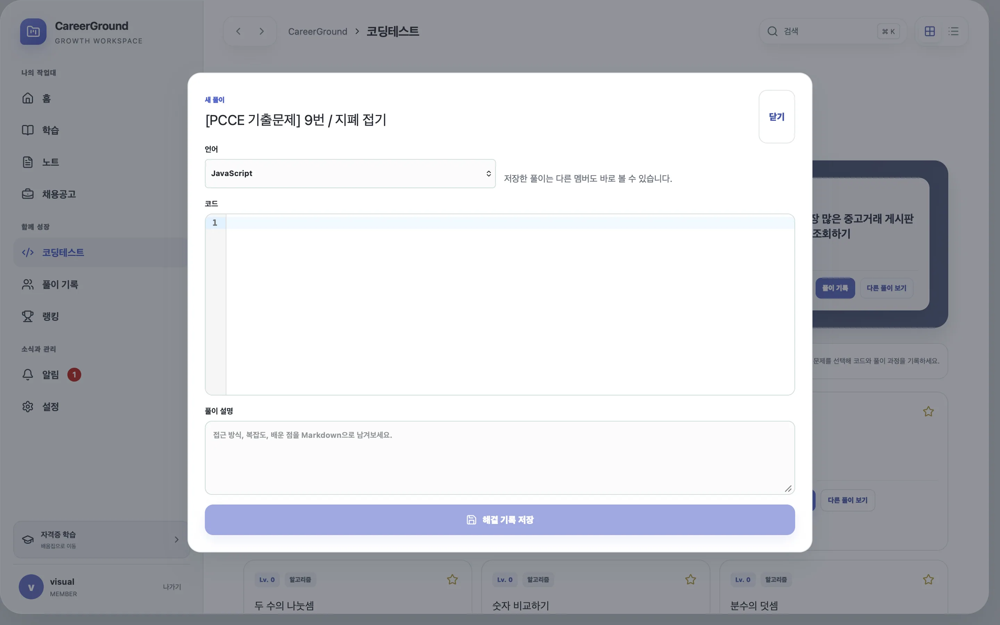

# 최신 232개 전수 감사에서 데이터 안전성과 핵심 흐름을 다시 고친 과정

## 문제와 기준선

`careerground_latest_full_audit_2026-08-14.md`는 `main`의
`764e9873d8856e2dcecbb6723130c853e4353470`을 기준으로 P0 8개, P1 81개,
P2 143개를 식별했다. 이 숫자는 운영에서 재현된 오류 232개가 아니라 코드 결함, 운영 위험,
제품 정책과 검증 공백을 분리한 백로그다. 따라서 이번 조치에서는 다음 세 상태를 섞지 않았다.

- 코드로 제거할 수 있는 위험은 migration, API, UI와 회귀 테스트를 같은 변경으로 닫는다.
- 운영 D1 export/restore, Sites cron 등록, 실제 보조기기처럼 현재 도구가 실행할 수 없는 검증은
  성공으로 표시하지 않는다.
- 풀이의 멤버 공개, 자동 랭킹, 이해도 1~5 제거, 데이터 export/삭제 요청 제거는 사용자가 이미
  결정한 제품 정책으로 기록한다. 감사 제안과 다르다는 이유로 몰래 되돌리지 않는다.

변경 전 같은 로컬 D1 fixture의 합성 p95는 jobs cursor 12.44 ms, coding cursor 1.28 ms,
solutions cursor 7.48 ms, notifications 1.77 ms, search 1.24 ms였다. 변경 전 자동 검증은
97개 unit/integration과 48개 E2E였고, 복구 훈련은 운영 데이터가 아닌 로컬 315-page
D1-compatible snapshot만 검증했다.

## 핵심 이론 1: migration version과 readiness는 같은 사실을 말해야 한다

과거 운영 장애는 artifact가 성공적으로 배포됐어도 D1의 FTS table과 응답 shape가 뒤처질 수
있음을 보여줬다. 이번에는 `0016_full_audit_hardening`을 명시적 migration version으로 두고,
ledger의 version/checksum, 필수 column, index, trigger, FTS를 readiness가 직접 검사하도록 했다.
단순 `SELECT 1`은 liveness로만 남겼다.

```diff
- GET /health/ready -> SELECT 1
+ GET /health/live  -> process liveness
+ GET /health/ready -> expected migration version
+                    + table/column/index/trigger/FTS inspection
+                    + representative data canary
```

구형 trigger는 `CREATE TRIGGER IF NOT EXISTS`만 호출하면 정의가 갱신되지 않는다. runtime upgrade는
관리 대상 trigger를 먼저 제거한 뒤 현재 정의로 다시 만들고, `app_schema_migrations`에 checksum과
적용 시각을 기록한다. production smoke도 ready 하나만 보지 않고 live, schema canary, root asset,
favicon, 인증 401과 보안 헤더를 확인한다.

요청 경로의 runtime schema 보강은 운영 D1에 migration을 직접 적용하는 Sites 기능이 현재
노출되지 않아 완전히 제거하지 못했다. liveness는 우회하고 isolate 안에서는 Promise를 공유해
중복 실행을 막았지만, OPS-004의 최종 상태는 여전히 부분 완화다. 관리면 migration이 제공되면
배포 단계 적용 후 요청 경로를 읽기 전용 version check로 축소해야 한다.

## 핵심 이론 2: 로컬 초안은 사용자와 서버 revision을 함께 식별해야 한다

문제 ID나 노트 ID만 localStorage key에 넣으면 같은 브라우저에서 계정을 바꿨을 때 다른 사용자의
입력이 보일 수 있다. 코드 초안은 `userId + schemaVersion + problemId`, 노트 초안은
`userId + noteId + baseRevision`으로 namespace했다. 계정 전환 시 다른 namespace를 읽지 않고,
빈 코드가 되면 오래된 초안을 삭제하며, 입력마다 synchronous write하지 않도록 debounce했다.

노트 저장은 초안의 base revision과 서버 revision이 다르면 자동 덮어쓰지 않는다. 충돌 화면에서
서버 최신본과 내 입력을 Myers diff로 비교하고, 사용자가 최신 기준을 확인한 후 다시 저장한다.

```diff
- localStorage[problemId] = code
+ localStorage[`coding-draft:v2:${userId}:${problemId}`] = { code, updatedAt }

- PATCH /notes/:id { markdown }
+ PATCH /notes/:id { title, markdown, baseRevision }
+ 409 REVISION_CONFLICT -> server/current diff -> explicit retry
```

저장 성공 뒤에는 해당 사용자 초안만 제거하고, 노트 전환·unmount 직전에는 pending timer를 flush한다.
변경이 없으면 저장 버튼이 비활성화되도록 해 NOTE-005/006의 거짓 상태도 제거했다.

## 핵심 이론 3: FULL import는 전체 diff와 제거 대상까지 승인해야 한다

100행 미리보기만 보여주면서 5,000행 batch를 commit하면 사용자가 보지 않은 변경을 승인하게 된다.
채용 import는 전체 preview를 페이지 단위로 탐색하고 JSON diff를 내려받을 수 있게 했다. commit은
서버가 발급한 preview token, 전체 검토 확인, 검토 행 수가 모두 일치해야 한다.

FULL snapshot에서 누락된 기존 공고는 별도 removal candidate로 계산한다. 제거 확인과 제거 건수가
일치하지 않으면 commit하지 않고, 제거 수가 `max(100, 새 package 행 수)`를 넘으면 서버가 차단한다.
거대한 `NOT IN (?, …)` 대신 snapshot item에 대한 `NOT EXISTS`를 사용한다. D1 batch는 채용 200,
학습 100, 학습 하위행 합계 500 단위로 제한했다.

```diff
- preview first 100 -> one-click commit of the whole batch
+ paginated full preview + downloadable JSON diff
+ reviewedRowCount + acknowledgeAllRows
+ removalCandidates + acknowledgeRemoval + removalCount
+ server-side destructive threshold
```

이는 UI 확인란만 추가한 것이 아니다. API가 확인 값과 preview metadata를 대조하므로 오래된 화면이나
직접 요청도 검토 단계를 우회하지 못한다.

## 핵심 이론 4: 조회 API는 write를 하지 않고, 생산자는 집합 연산으로 실행한다

과거 unread-count GET은 마감 공고와 복습 알림을 만들었다. 읽기 트래픽이 늘면 같은 요청이 알림
생성, rate-limit row 갱신과 사용자별 N+1 query를 유발했다. unread 조회를 순수 SELECT로 바꾸고,
scheduled producer는 마감 알림 3개 집합 쿼리와 복습 알림 1개 `INSERT … SELECT`로 변환했다.
dedupe key와 lease는 재시도에서도 중복 알림을 막는다.

알림 목록에는 unread filter와 cursor를 연결하고, 읽음 처리는 이동을 막지 않는 optimistic update로
바꿨다. 앱 셸의 unread count는 짧은 polling으로 다른 화면의 변경도 반영한다.

## 핵심 이론 5: 공통 카탈로그와 사용자 데이터의 경계를 API에서 강제한다

채용공고, 코딩문제, 학습자료와 멤버 공개 풀이는 인증된 모든 멤버가 조회한다. 폴더, 노트,
지원 상태, 초안은 항상 현재 user ID로 제한한다. 풀이·노트·폴더 삭제는 soft delete와 복원을
제공하고, 삭제된 풀이는 랭킹과 collection item에서 즉시 제외한다.

사용자 관리에는 역할·활성 상태 변경과 감사 로그를 추가했다. 자기 역할/활성 상태는 스스로
바꿀 수 없고, 기존 ADMIN은 환경 allowlist에서 빠졌다는 이유로 매 요청 MEMBER로 강등하지 않는다.
첫 사용자 가입 상한은 `COUNT` 후 `INSERT`가 아닌 조건부 원자 `INSERT … SELECT`로 처리한다.

## 사용자 흐름에서 닫은 대표 단절

- 폴더 항목의 원본 열기, 이동, 제거, 순서 변경, subtree 삭제·복원
- 문제 상세 deep link, 사용자별 코드 초안 복원, 전체 풀이/복사/삭제·복원
- 댓글 수정·삭제·신고, Markdown 표시, O(n) tree 구성
- 학습 객관식 type/choices 보존·채점, 실제 복습 예정 목록, 단원 폴더 저장
- 채용 달력과 목록의 동일 검색/저장 filter, 42일 인접월 조회, FTS 검색, publishedAt 보존
- 검색 relevance/keyset cursor, 사용자별 최근 검색, ARIA combobox와 OS별 단축키
- 랭킹의 `selfReported: true`, native table, 자가 기록 산식과 제외 조건 공개
- 관리자 문제 track, import 전체 검토, 사용자 역할/활성 상태, 운영 schema health 표시

## 화면 증거

초기 MVP와 현재 Finder형 창을 같은 계열 viewport로 비교한다. 아래 현재 화면은 동적 문제 영역을
가리지 않은 실제 회귀 캡처다.




## 검증 결과

최종 수치는 이 변경을 commit하기 직전에 같은 runtime에서 다시 기록한다.

| 검증                      | 결과                                                                                    |
| ------------------------- | --------------------------------------------------------------------------------------- |
| `pnpm lint`               | 통과                                                                                    |
| `pnpm typecheck`          | 통과                                                                                    |
| `pnpm test`               | 98/98 통과                                                                              |
| `pnpm test:e2e`           | 48/48 통과, Chromium/Firefox/WebKit/375 px 모바일                                       |
| `pnpm build`              | API/web/docs production build 통과                                                      |
| `pnpm sites:build`        | Worker + static artifact build 통과                                                     |
| `pnpm performance:budget` | 위반 0; jobs 8.76, coding 1.08, solutions 6.22, notifications 1.48, search 36.87 ms p95 |
| `pnpm recovery:drill`     | 316 pages, snapshot 1.60 ms, restore 1.32 ms, integrity/FK/checksum 통과                |

검색 p95는 변경 전 1.24 ms보다 커졌다. 이전 구현은 rowid 순으로 바로 잘랐지만 현재 구현은
81,000개의 공통 토큰 합성 match를 FTS relevance로 정렬한다. 최초 BM25 구현의 65.82 ms에서
보조 정렬을 제거해 36.87 ms로 44.0% 줄였고 150 ms budget 안이지만, 이 수치를 성능 향상으로
표현하지 않는다. 관련도 요구를 만족하기 위해 지불한 측정 가능한 비용이며 운영 RUM은 별도다.

## 완료로 표시하지 않은 경계

1. **운영 D1 export/restore:** 설치된 Sites connector에 export/restore operation이 없다. 로컬
   executable drill과 runbook은 있지만 운영 RTO/RPO 증거는 아니다.
2. **Sites cron 등록:** `scheduled()` handler, lease, dedupe와 집합 기반 producer는 구현했지만
   connector에서 cron 등록/last-run 상태를 설정하거나 조회할 수 없다.
3. **실제 OpenAI handshake와 접근성 장비:** mock header E2E, axe, keyboard, 200% reflow와 세 브라우저는
   검증하지만 실제 OpenAI 세션 만료, NVDA/VoiceOver/TalkBack, 모바일 한글 IME는 현재 자동화 환경의
   증거가 아니다.
4. **대형 라우터/중복 reference backend:** 즉시 기능 오류가 아닌 구조적 부채다. 이번 대규모 기능
   수정과 동시에 파일을 분해하면 회귀 범위가 더 커지므로 별도 refactor gate로 남긴다.

전체 232개 판정과 제품 결정은
`docs/audits/careerground-latest-full-audit-resolution-2026-08-14.md`를 기준으로 한다. 이전
`2026-08-14-complete-audit-remediation.md`의 131개 감사 결론은 당시 범위의 기록이며, 최신 감사의
완료 판정으로 재사용하지 않는다.
