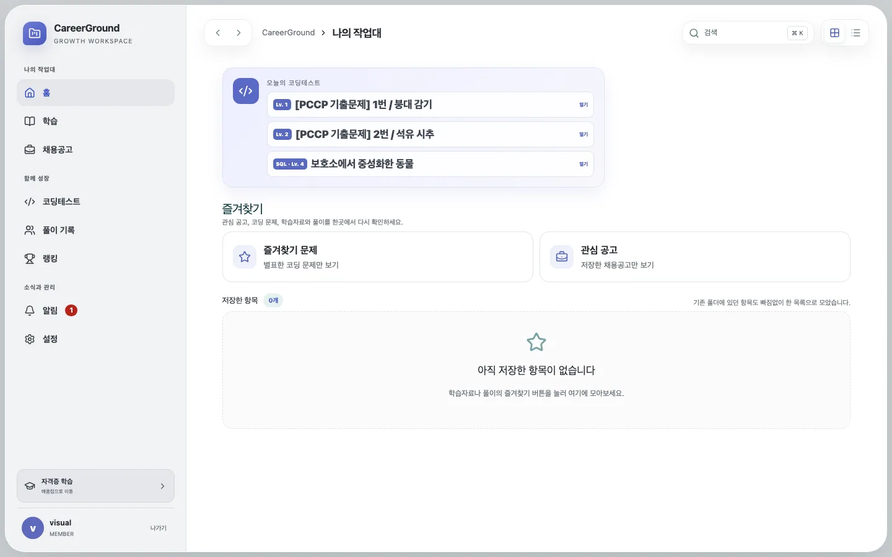
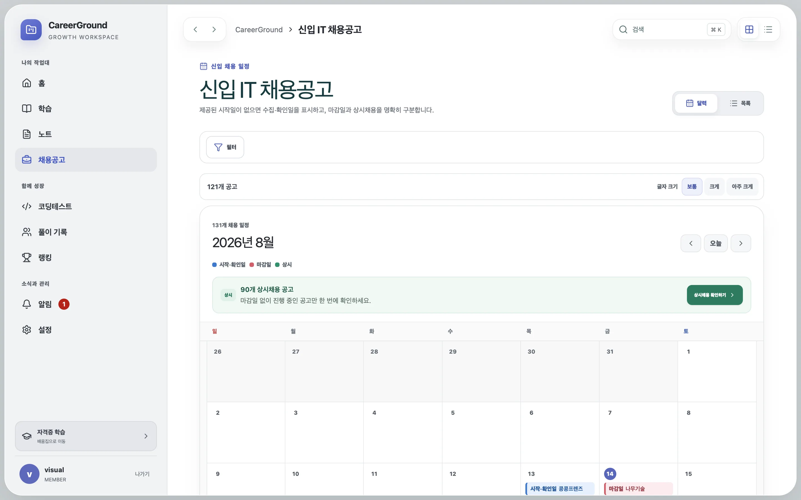
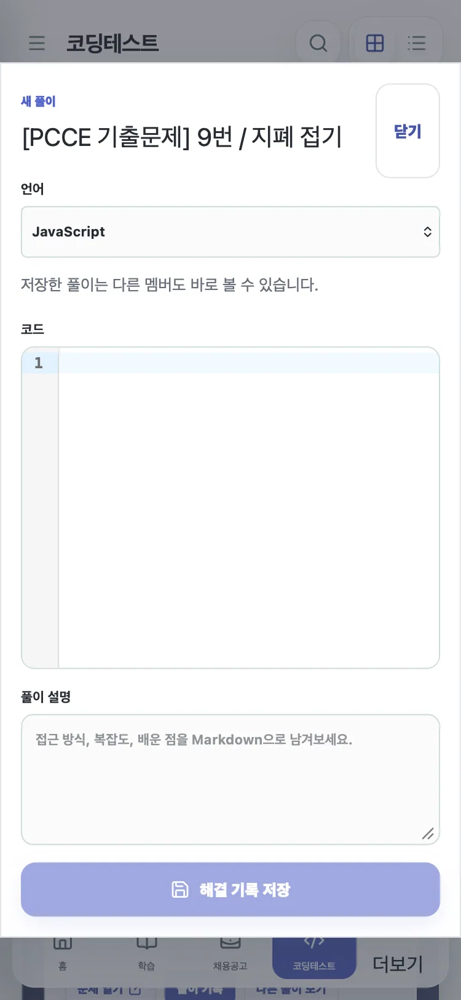

# 대용량 목록·중복 쓰기·삭제 복구를 함께 안정화한 후속 조치

## 증상과 영향

131개 감사 후에도 채용·문제·풀이 목록은 고정 상한의 큰 배열을 한 번에 반환했고, 반응 토글과 알림 생성은 재시도 시 최종 상태가 흔들리거나 중복될 여지가 있었다. 폴더·노트는 soft delete 컬럼이 있어도 복구 API/UI가 없어 사용자 관점에서는 삭제와 영구 유실이 같았다. 수동 modal은 focus trap이 없고, 채용 달력은 시각적 표이지만 키보드 grid 탐색을 제공하지 않았다.

## 핵심 이론

### Offset가 아닌 keyset cursor

변경되는 목록의 `OFFSET n`은 앞 행이 추가·삭제되면 중복 또는 누락을 만든다. 현재 정렬 키와 고유 ID를 cursor에 넣고 다음 조건을 사용하면, 이미 본 행 뒤에서 안정적으로 이어갈 수 있다.

```diff
- SELECT ... ORDER BY created_at DESC LIMIT 200
+ SELECT ...
+ WHERE (created_at < :cursorCreatedAt)
+    OR (created_at = :cursorCreatedAt AND id < :cursorId)
+ ORDER BY created_at DESC, id DESC
+ LIMIT :pageSizePlusOne
```

클라이언트는 TanStack Query `useInfiniteQuery`로 페이지를 이어 붙이고 `nextCursor`가 있을 때만 “더 보기”를 표시한다. 달력은 월 전체 일정이 필요하므로 기존 bounded calendar 응답을 유지해 서로 다른 사용 목적을 억지로 합치지 않았다.

### Desired state와 idempotency

“현재 값을 뒤집어라”는 재시도에 안전하지 않다. 네트워크가 응답 전에 끊기면 같은 요청을 다시 보낼 때 원래 상태로 되돌아간다. `PUT { active: true|false }`와 unique key를 결합하면 같은 의도를 여러 번 보내도 최종 상태가 같다.

```diff
- POST /solutions/:id/reaction  // toggle
+ PUT /solutions/:id/reaction { "active": true }
+ INSERT ... ON CONFLICT(solution_id, user_id) DO NOTHING
```

마감 알림도 `user + job + D-day`로 `dedupe_key`를 만들고 unique index와 `ON CONFLICT DO NOTHING`을 적용했다. 애플리케이션의 사전 조회만으로 중복을 막지 않고 DB 제약을 마지막 방어선으로 둔 것이 핵심이다.

### Soft delete는 복구 경로까지 있어야 한다

폴더 삭제 시 동일 timestamp로 하위 트리를 표시하고, 복구 시 그 timestamp가 같은 행만 함께 되살린다. 삭제 전에 이미 휴지통에 있던 하위를 잘못 복구하지 않기 위해서다. 노트도 사용자 ID를 조건에 포함한 trash/restore API와 UI를 연결했다.

### 접근성과 운영 관측도 동작의 일부다

Radix Dialog로 filter, folder selector, 코드 editor, 학습, 공고 상세 modal의 focus trap·Escape·focus return을 통일했다. 달력은 `grid → row → gridcell` 구조와 단일 `tabIndex=0`을 사용하고 화살표/Home/End로 roving focus를 이동한다.

모든 API 응답은 `x-request-id`, `server-timing`, `x-response-time-ms`를 반환한다. 로그에는 사용자 데이터나 실제 UUID 대신 HTTP method, 정규화 route, status, duration만 기록한다.

## 수정 전후 수치

동일한 in-memory D1 compatibility adapter, Node v26.7.0, endpoint당 7회, job 50,000/problem 10,000/solution 20,000/comment 100,000 fixture에서 legacy 응답과 cursor 첫 페이지를 비교했다.

| 목록      | legacy 응답 | cursor 응답 | 감소율 | legacy p50 | cursor p50 |
| --------- | ----------: | ----------: | -----: | ---------: | ---------: |
| 채용      |   114,108 B |    26,092 B |  77.1% |    6.78 ms |    9.36 ms |
| 코딩 문제 |   110,292 B |    13,166 B |  88.1% |    1.63 ms |    0.97 ms |
| 공유 풀이 |   102,211 B |    20,579 B |  79.9% |    6.23 ms |    6.02 ms |

채용 cursor는 total count와 cursor 생성 쿼리가 추가되어 로컬 p50이 2.58 ms 늘었지만, 첫 응답 전송량은 88,016 B 줄었다. 즉 DB micro-benchmark만 빠르다고 주장하지 않고 초기 payload·DOM 행 수 감소를 선택한 trade-off다. 운영 network latency와 실제 브라우저 initial render의 전후 수치는 이 환경에서 `정량 측정 불가`다.

## 방어 기능과 회귀 테스트

- 사용자·정규화 경로별 분당 rate limit: 읽기 기본 240, 쓰기 기본 60, import 최대 10. 초과 시 `429`와 `Retry-After`.
- 동일 reaction `active=true`를 두 번 보내도 행 1개와 count 1.
- 동일 D-3 알림 producer를 두 번 호출해도 알림 1개.
- 채용 20개, 문제 25개, 풀이 1개 cursor 다음 페이지가 첫 페이지와 겹치지 않음.
- 폴더 트리와 노트 delete → trash → restore 통합 테스트.
- 노트 편집은 사용자/노트별 localStorage에 500 ms debounce로 임시 저장하고 명시적 저장 후 제거.
- evidence collector는 `12 passed` 문자열보다 마지막 `exit code: 1`을 우선해 실패로 판정.

검증 명령:

```text
pnpm format:check
pnpm lint
pnpm typecheck
pnpm test
pnpm test:e2e
pnpm build
pnpm sites:build
node_modules/.bin/tsx scripts/performance/benchmark-d1.mjs
```

최종 고정 도구 체인은 Node `24.19.0`, pnpm `11.21.0`이다. 2026-08-14 재검증 결과는 다음과 같다.

| 검증             | 최종 결과  | 세부 결과                                    |
| ---------------- | ---------- | -------------------------------------------- |
| format           | 통과       | 전체 Prettier 검사                           |
| lint             | 통과       | ESLint 오류·경고 0                           |
| typecheck        | 통과       | API, web, docs, packages, Sites runtime      |
| unit/integration | 85/85 통과 | contracts 8, API 32, web 17, D1·문서 도구 28 |
| E2E              | 44/44 통과 | Chromium, Firefox, WebKit, 375 px mobile     |
| production build | 통과       | API, web, docs 전체 빌드                     |
| Sites build      | 통과       | D1 worker와 정적 bundle 조립                 |

최종 실행 전 새 노트 임시저장 테스트는 Testing Library cleanup 누락으로 동일한 `노트 제목` textbox가 여러 렌더에 남아 1건 실패했다. `apps/web/src/test/setup.ts`에 공통 `afterEach(cleanup)`을 추가한 뒤 단일 web suite 17/17과 전체 suite 85/85를 다시 통과했다. 첫 E2E 재실행은 샌드박스가 `tsx` IPC pipe 생성을 `EPERM`으로 차단해 테스트가 시작되지 않았고, 동일 명령을 허용된 로컬 실행 환경에서 다시 수행해 44/44를 확인했다. 둘 다 제품 실패로 숨기지 않고 원인과 최종 재검증 결과를 함께 남긴다.

production build에는 minified chunk 하나가 500 kB를 넘는 경고가 남는다. build 실패는 아니지만 초기 JavaScript 비용을 더 줄이려면 Monaco 계열 editor bundle의 추가 lazy loading이 후속 개선 대상이다.

현재 화면 회귀 증거는 아래 경로에 저장했다.

- `docs/assets/troubleshooting/current/home-desktop-1440.webp`
- `docs/assets/troubleshooting/current/jobs-calendar-desktop-1440.webp`
- `docs/assets/troubleshooting/current/coding-desktop.webp`
- `docs/assets/troubleshooting/current/jobs-calendar-mobile-375.webp`

### 현재 Finder형 워크스페이스



### 채용 달력과 색상 구분



### 모바일 풀이 dialog



## 남은 위험

검색은 여전히 `LIKE` 기반 10개 상한이며 FTS/cursor가 없다. 학습 목록과 solution list/detail DTO의 완전 분리, D1 기존 전체 스키마의 FK 재구성, 실제 운영 export/restore 훈련, 플랫폼 SLO/alert 연결도 남아 있다. 이 항목들은 코드 일부가 개선되었다는 이유로 완료 처리하지 않았다.

## 근거

- `docs/evidence/performance-pagination-2026-08-14.json`
- `deployment/sites/d1-api.test.ts`
- `apps/web/src/pages/DomainPages.test.tsx`
- `apps/web/src/pages/NotesPage.test.tsx`
- `scripts/troubleshooting/collect-evidence.test.ts`
- `docs/audits/careerground-audit-remediation-2026-08.md`
