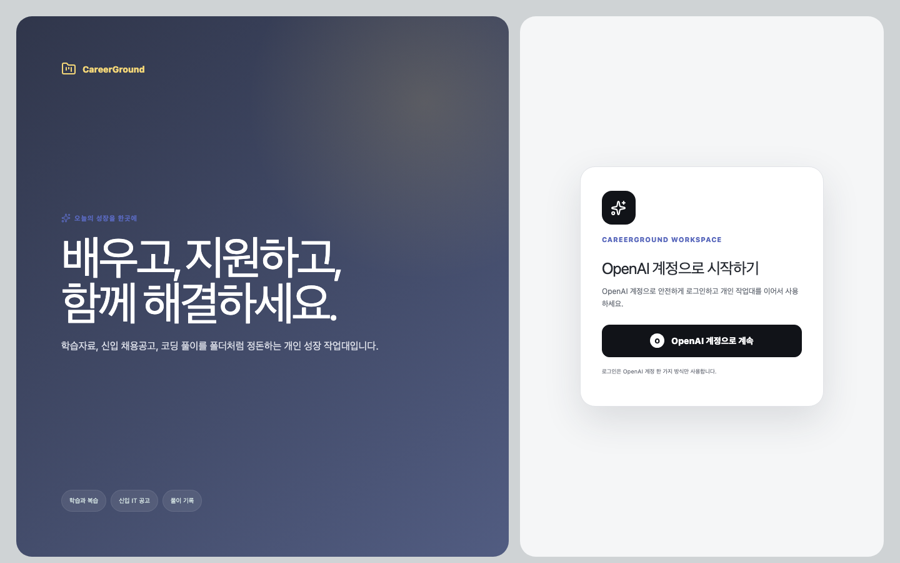
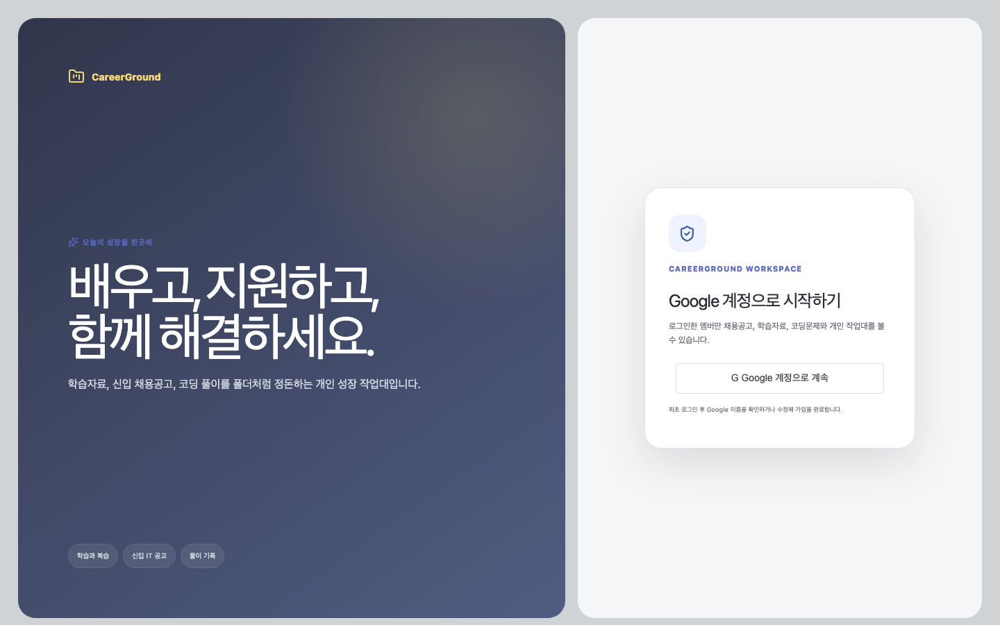
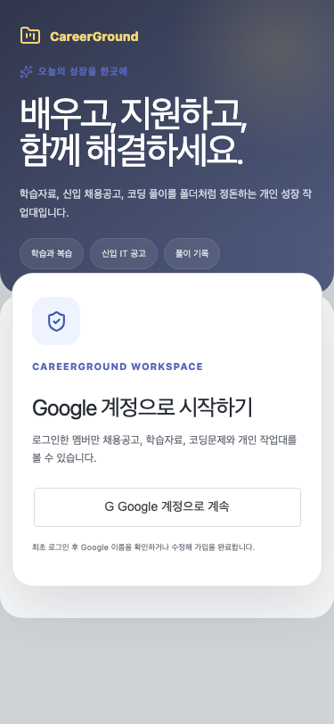

> 2026-08-25 후속 감사에서 요청 경로의 자동 purge가 안전하지 않은 것으로 판정되어 제거됐다.
> 현재 readiness는 읽기 전용 검사만 수행하며 불일치 시 `DB_SCHEMA_NOT_READY` 503을 반환한다.
> 최신 정책과 검증은 [런타임 스키마 파괴 경로와 채용공고 불변성 복구](./2026-08-25-runtime-schema-and-job-immutability.md)를 따른다.

# OpenAI 전달 헤더에서 Google 검증 세션으로 인증 경계를 교체한 과정

## 문제와 영향

기존 운영 Worker는 Sites가 전달하는 `oai-authenticated-user-id`와 이메일을 사용자 식별자로 사용했고, 로그인 화면은 `/signin-with-chatgpt`로 이동했다. 사용자가 기존 연결과 개인 테스트 데이터를 폐기하고 Google 계정만 사용하도록 요구했기 때문에 버튼만 교체해서는 부족했다. Google ID 토큰 검증, 애플리케이션 세션, D1 사용자 식별자, 로그아웃과 최초 가입을 하나의 vertical slice로 바꿔야 했다.

특히 브라우저에서 JWT payload만 디코딩해 이메일을 신뢰하면 서명·대상 애플리케이션·만료를 확인하지 않는 인증 우회가 된다. 이메일만으로 과거 계정을 자동 연결하면 같은 이메일처럼 보이는 다른 provider subject에 기존 데이터가 넘어갈 수 있다.

## 핵심 이론 1: OIDC 토큰은 서명과 claim을 함께 검증한다

Worker는 Google JWKS를 cache-control 범위 안에서 캐시하고 `kid`에 해당하는 RSA 공개키를 가져온다. 키 회전으로 캐시에 `kid`가 없으면 JWKS를 한 번 새로 받은 뒤 다시 찾는다.

```diff
- const userId = request.headers.get('oai-authenticated-user-id')
- const email = request.headers.get('oai-authenticated-user-email')
+ const identity = await verifyGoogleCredential(credential, GOOGLE_CLIENT_ID)
+ // RS256 signature, iss, aud, exp, iat, email_verified, sub
```

사용자 불변 식별자는 이메일이 아니라 검증된 Google `sub`다. `auth_identities(provider, provider_subject)` unique index가 하나의 Google 계정이 여러 내부 사용자에 연결되는 것을 막는다. 과거 OpenAI 계정은 연결하지 않으며 이메일 충돌은 `409 GOOGLE_IDENTITY_CONFLICT`로 중단한다.

## 핵심 이론 2: 세션 원문은 브라우저에만, DB에는 해시만 둔다

로그인 성공 시 Web Crypto로 256-bit 무작위 토큰을 만들고 D1에는 SHA-256 해시만 저장한다. DB가 노출돼도 저장된 값만으로 세션 쿠키를 재현할 수 없게 하기 위한 경계다.

```text
Google ID token
  → Worker 서명·claim 검증
  → auth_identities의 Google sub 조회
  → 256-bit session token 생성
  → D1: SHA-256(token)
  → Browser: HttpOnly; Secure; SameSite=Lax; Path=/
```

세션은 7일 후 만료되며 로그아웃 시 현재 해시 행과 쿠키를 모두 삭제한다. 로그아웃 직후 같은 쿠키로 `/auth/me`를 호출하면 `401`이 되는 회귀 테스트를 추가했다. health와 Google 로그인 endpoint 외에는 세션을 요구하므로 비로그인 상태에서 채용·학습·코딩 공통 데이터도 조회할 수 없다.

## 핵심 이론 3: provider 교체 migration은 개인 데이터와 공통 카탈로그를 분리한다

`0022_google_auth`는 OpenAI 전용 unique index와 `site_user_id` 컬럼을 제거하고 Google identity/session 테이블을 만든다. `0023_purge_legacy_personal_data`는 D1 migration 실행 시 foreign-key cascade 설정에 의존하지 않고 폴더, 지원 상태, 진도, 풀이, 댓글, 알림과 세션성 데이터를 자식 테이블부터 명시적으로 삭제한다. 채용공고, 학습자료, 코딩문제와 같은 사용자 비소유 공통 카탈로그는 보존한다.

```diff
+ DELETE FROM audit_logs;
+ DELETE FROM collections;
+ DELETE FROM learning_progress;
+ DELETE FROM problem_progress;
+ DELETE FROM notifications;
+ DELETE FROM request_rate_limits;
+ DELETE FROM users;
+ DROP INDEX idx_users_site_user_id;
+ ALTER TABLE users DROP COLUMN site_user_id;
+ CREATE TABLE auth_identities (...);
+ CREATE TABLE auth_sessions (...);
```

운영 migration이 누락되는 상황에 대비해 runtime schema 검사도 `auth_identities`, `auth_sessions`, legacy column 부재, `0023_purge_legacy_personal_data` ledger를 확인한다. runtime 보정은 이 ledger가 없을 때만 개인 데이터 전량 삭제를 수행하고 삭제문과 ledger 기록을 하나의 D1 batch로 묶었다. 따라서 중간 실패 후 재시도하더라도 이후 정상 Google 회원 데이터가 다시 삭제되지 않는다. migration 회귀 테스트는 0016 기준 DB에 0017~0023을 순서대로 적용해 개인 테이블 합계 0, auth table 2개, legacy column 0개와 기존 학습 문항·채용·코딩 공통 데이터 보존을 확인한다.

## 화면 전후

### 변경 전: OpenAI 로그인



### 변경 후: Google 로그인



### 375×812 모바일



Google 이름은 최초 가입 화면의 입력 초깃값으로 전달된다. 사용자는 이름을 확인하거나 수정하고 Python, Java, JavaScript, C++ 중 하나를 선택한 뒤 가입을 완료한다.

## 검증 결과

| 검증                | 결과                                             |
| ------------------- | ------------------------------------------------ |
| `pnpm format:check` | 통과                                             |
| `pnpm lint`         | 통과                                             |
| `pnpm typecheck`    | 통과                                             |
| `pnpm test`         | 129/129 통과                                     |
| `pnpm test:e2e`     | 56/56 통과, Chromium·Firefox·WebKit·375px 모바일 |
| `pnpm build`        | 통과                                             |
| `pnpm sites:build`  | 통과, 운영 기준선 이후 순방향 migration만 포함   |
| axe                 | 1440×900·375×812 serious 이상 위반 0             |

인증 지연 시간은 이전 provider와 Google provider를 같은 운영 조건에서 측정하지 않았으므로 정량 개선을 주장하지 않는다. 실제 Google 계정 팝업 완료는 자동화가 대신할 수 없으며 운영 배포 후 사용자가 한 번 상호작용해 확인해야 한다.

## 운영 배포 중 발견한 migration archive 충돌

첫 version 46 배포는 publish 전에 `table job_source_snapshot_items already exists`로 중단됐다. 애플리케이션의 `sites:build` 결과는 운영 기준선 이후의 `0016`, `0017`만 포함했지만, 공식 packager를 저장소 루트에 직접 실행하면서 루트 `drizzle/`의 `0000`~`0015`가 archive에 다시 덮어써졌다. runtime bootstrap으로 이미 생성된 운영 테이블에 과거 `0013`을 재실행한 것이 직접 원인이었다.

```diff
- package-site.sh <repository-root> <archive>
+ pnpm sites:stage <empty-temporary-directory>
+ package-site.sh <staged-directory> <archive>
```

`sites:stage`는 archive에 기준선 이전 migration이 하나라도 있으면 실패하며, repository-root `drizzle/`를 의도적으로 복사하지 않는다. 재배포 archive에는 `0016_full_audit_hardening.sql`, `0017_google_auth.sql` 두 파일만 포함되는 것을 `tar` 목록으로 재확인했다. 이 실패는 새 Worker가 publish되기 전 migration 단계에서 발생했으므로 성공 배포로 기록하지 않았고, 수정 archive는 새 Git commit과 Sites version으로 다시 저장한다.

version 47은 publish됐지만 첫 운영 health check에서 `DB_SCHEMA_INITIALIZATION_FAILED`를 반환했다. 운영 D1을 읽어 `0017_google_auth` 적용, 사용자·인증 데이터 0건, 공통 카탈로그 보존을 확인했고, 기준 스키마 중 `notes`, `note_revisions` 두 개인 테이블만 누락된 것을 찾았다. 검색 backfill은 빈 개인 노트 테이블도 참조하므로 이 누락이 초기화 전체를 503으로 만들었다.

runtime schema가 검색 backfill보다 먼저 두 테이블과 인덱스를 `IF NOT EXISTS`로 복구하도록 보정했다. 기존 개인 데이터는 이미 폐기됐기 때문에 빈 테이블만 생성하며 공통 카탈로그 행은 변경하지 않는다. 누락 상태를 재현해 notes 테이블 2개와 인덱스 2개가 복구되고 D1 API 회귀 테스트까지 포함한 30개 검증이 통과하는 테스트를 추가했다.

version 49 재배포 후 운영 health는 200과 `ready: true`를 반환했다. 검색 트리거 18개, 인증 테이블 2개, legacy identity 컬럼 0개를 확인했고, 비로그인 채용·학습·코딩 API, 운영 테스트 로그인 endpoint, 구 OpenAI 헤더 인증은 모두 401이었다. 운영 로그인 화면은 Google 버튼 iframe 1개가 렌더링되고 loading skeleton이 사라진 상태를 확인했다. 이후 최신 `main`의 노트 기능 제거와 채용·학습 성능 개선을 병합하면서 Google migration 번호를 `0022`로 이동하고 검색 트리거 기대값을 15개로 갱신했다. 실제 Google 계정 선택과 consent 완료는 사용자의 계정 상호작용으로 한 번 더 확인해야 한다.

version 50은 병합 commit을 정상 게시했고 `0022_google_auth`도 ledger에 적용됐다. 첫 병렬 smoke 요청은 migration 적용과 겹쳐 일부 `503 DB_SCHEMA_INITIALIZATION_FAILED`를 반환했지만, ledger 반영 뒤 재검사는 health 200, `ready: true`, 채용 51건·코딩 427건·학습 23건을 반환했다. 비로그인 공통 API 세 곳은 모두 401이었다.

행 단위 운영 검증에서는 `users`, `auth_identities`, `auth_sessions`가 0건인데도 과거 `collections`, `learning_progress`, `problem_progress`, `notifications`, `request_rate_limits`가 남은 모순을 발견했다. 운영 D1 경로에서 `DELETE users` 당시 foreign-key cascade가 적용됐다고 가정한 것이 원인이었다. `0023_purge_legacy_personal_data`는 모든 사용자 소유 테이블을 의존 순서대로 직접 삭제하고, `workspace_search`에서는 빈 owner를 사용하는 공통 카탈로그만 보존한다.

version 51에 병합 commit `ddfe4a4`를 배포한 뒤 health는 `0023_purge_legacy_personal_data` 적용과 `ready: true`를 반환했다. 운영 DB에서 사용자·인증·폴더·풀이·진도·지원·알림·감사 로그 등 개인 테이블 19개를 각각 조회해 모두 0건임을 확인했다. 동시에 채용 51건, 코딩문제 427건, 학습자료 23건은 유지됐고 검색 행은 개인 고아 레코드 1건이 제거되어 502건에서 501건으로 줄었다. 비로그인 채용·학습·코딩 API와 운영 테스트 로그인은 모두 401이었다. 실제 브라우저에서는 Google iframe 1개, OpenAI 문구 0개, loading skeleton 0개, 콘솔 오류 0개를 확인했다.

병합 뒤 `main` CI에서는 운영 기준선 전체를 파일 기반 SQLite에 재현하는 회귀 테스트가 assertion 실패 없이 26.981초를 사용했지만, 고정된 15초 테스트 제한을 넘어 실패했다. 같은 테스트는 로컬과 PR 러너에서는 통과했으므로 제품 로직 실패가 아니라 러너 I/O 편차가 원인이었다. 검증 범위와 assertion은 유지하고 이 통합 테스트에만 60초 제한을 부여해 관측된 최장 시간 대비 2.2배 여유를 확보했다. 단위 테스트의 전역 제한은 변경하지 않았다.

## PR CI에서 발견한 잔여 OpenAI 의존과 전이 의존성 취약점

최신 `main` 병합 뒤 제품 API 테스트는 통과했지만 성능 예산 스크립트는 제거된 OpenAI 전달 헤더로 `/auth/me`를 호출해 `401`로 중단됐다. 모든 성능 스크립트가 공통 helper로 runtime schema를 준비하고 로컬에서만 활성화되는 `/auth/test`로 Google 세션 쿠키를 만든 뒤 동일한 인증 경계를 통과하도록 바꿨다. 성능 예산은 재실행 후 실패 항목 0개였고, 별도 phase/job/learning benchmark 4개도 모두 종료 코드 0을 확인했다.

같은 CI의 `pnpm audit --audit-level high`는 Prisma 7.9.1이 고정한 `deepmerge-ts 7.1.5`의 recursive graph stack exhaustion 취약점 1개를 탐지했다. Prisma 최신 안정판도 같은 버전을 고정하고 있어 workspace override로 패치판 8.0.1을 사용했다. `prisma generate` 호환성을 확인했고 audit 결과는 고위험 1개에서 알려진 취약점 0개로 바뀌었다.

CodeQL은 로컬 D1 HTTP adapter가 `String(error)`를 응답 본문에 넣어 내부 예외와 stack 정보가 노출될 수 있는 `js/stack-trace-exposure` 경고를 찾았다. 원본 예외는 서버 로그에만 남기고 클라이언트에는 고정된 한국어 오류 메시지만 반환하도록 경계를 분리했다.

Google 토큰의 `aud` 배열 검사에는 정확 일치 연산을 사용하고 있었지만, CodeQL은 배열의 `includes` 호출을 URL 부분 문자열 검사로 해석해 `js/incomplete-url-substring-sanitization`을 보고했다. 검증 의도를 정적 분석에도 명확히 전달하기 위해 문자열 audience만 `Set`으로 정규화한 뒤 `Set.has(expectedClientId)`로 비교했다. 실제 Client ID 앞뒤에 공격자 문자열을 붙인 audience 두 개가 배열에 함께 들어와도 `GOOGLE_TOKEN_AUDIENCE_INVALID`로 거부되는 회귀 테스트를 추가했다.

원격 Playwright에서는 macOS에서 생성한 Google 로그인 모바일 기준 이미지와 Linux의 한글 글꼴 안티앨리어싱이 달라 픽셀 5%가 변경된 것으로 판정됐다. 실제·기준·diff 산출물을 비교했을 때 요소 위치와 크기는 같고 글자 가장자리만 달랐다. 다른 스냅샷의 전역 3% 기준은 유지하고 이 한 장에만 6% 허용치를 적용해 레이아웃 회귀 감도는 보존했다. 기능 assertion과 axe 접근성 검사는 별도로 계속 실행한다.

## 근거

- `docs/evidence/google-auth-2026-08-18.json`
- `deployment/sites/google-auth.ts`
- `deployment/sites/google-auth.test.ts`
- `deployment/sites/d1-api.test.ts`
- `deployment/sites/runtime-schema.test.ts`
- `drizzle/0022_google_auth.sql`
- `drizzle/0023_purge_legacy_personal_data.sql`
- `apps/web/src/pages/LoginPage.test.tsx`
- `e2e/mvp.spec.ts`
- `e2e/visual.spec.ts`
