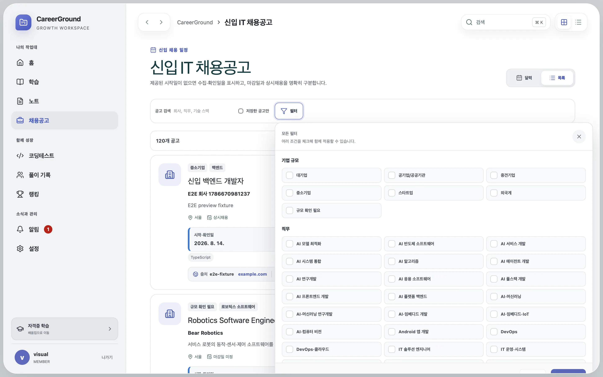
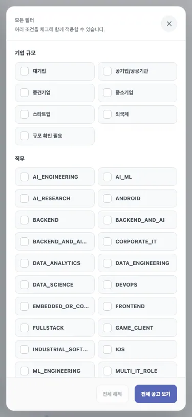
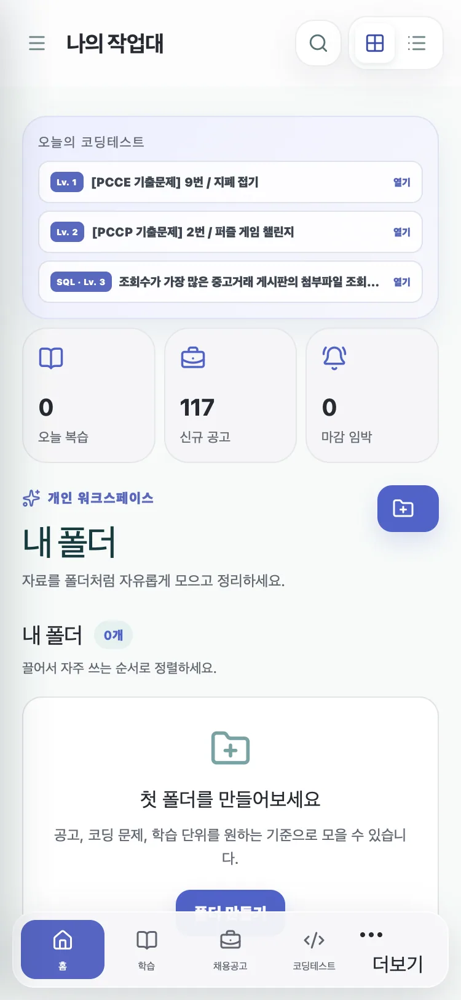
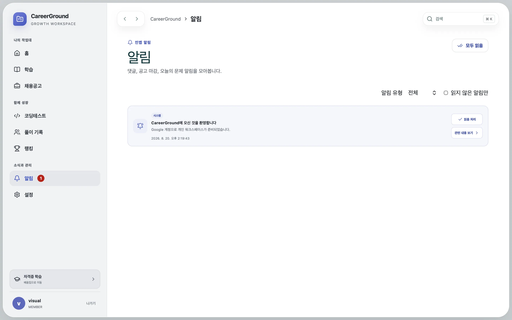

# 직무 필터·알림 동작·개인 워크스페이스 단순화

## 증상과 기준선

채용 직무에는 `BACKEND` 같은 DB 값이 그대로 표시됐고, 필터 카드는 선택 색상만 바뀐 채
왼쪽 체크 표시는 비어 있었다. 홈의 `신규 공고`와 `마감 임박`은 계산 범위를 설명하지
않아 숫자의 의미를 판단하기 어려웠다. 알림은 카드 전체가 버튼이어서 메시지를 누르는
것만으로 읽음 처리와 페이지 이동이 동시에 일어났다. 개인 작업대에는 폴더 관리와
즐겨찾기가 함께 있어 같은 저장 목적에 두 개의 모델이 노출됐다.

근거와 최종 검증값은
[`docs/evidence/favorites-filter-notifications-2026-08-20.json`](../evidence/favorites-filter-notifications-2026-08-20.json)에
기록했다.

| 항목                              | 변경 전 |      변경 후 |
| --------------------------------- | ------: | -----------: |
| 한글 표시를 보장한 영문 직무 코드 |       0 |           33 |
| 홈의 모호한 채용 요약 카드        |       2 |            0 |
| 홈 bootstrap LocalD1 쿼리         |       6 |            5 |
| 알림 행의 암묵적 이동 영역        |       1 |            0 |
| 알림 행의 명시적 동작             |       0 |     최대 2개 |
| 화면에 노출되는 개인 정리 모델    |       2 | 즐겨찾기 1개 |

홈 bootstrap은 전후 모두 D1 batch 1회를 유지했다. 동일 LocalD1 fixture의 준비 SQL 수가
6개에서 5개로 줄었다는 사실만 주장하며, 운영 지연 시간의 전후 표본이 없으므로 속도 개선율은
산정하지 않는다.

## 핵심 이론 1: 저장 값과 표시 값을 분리한다

DB enum은 데이터 정합성을 위한 값이고 UI 문구는 사용자 언어다. 33개 알려진 직무 코드를
한글로 매핑하고, 필터 상태와 catalog 비교도 표시값 기준으로 정규화했다. 이 방식은
`BACKEND`와 과거의 `백엔드`가 함께 있어도 체크박스 하나로 합쳐 처리한다.

```ts
const selectedCategories = dedupeOrdered(searchParams.getAll('category').map(categoryLabel));

const categories = [...new Set(catalog.map((job) => categoryLabel(job.category)))];
```

체크 표시가 변하지 않은 원인은 CSS와 DOM 계약 불일치였다. 기존 selector는 존재하지 않는
`data-state` wrapper를 기대했다. 실제 native input에 맞춰 인접 형제 selector를 사용하고,
선택 시 `Check` SVG도 함께 렌더링한다.

```css
.job-filter-options input:checked + .multi-filter-check {
  color: #fff;
  background: #5867b9;
  border-color: #5867b9;
}
```





## 핵심 이론 2: 모호한 숫자보다 검증 가능한 행동을 남긴다

`신규 공고`는 최근 import로 생성 시각이 몰릴 때 활성 catalog 전체가 새 항목처럼 보일 수
있었고, `마감 임박`은 저장한 공고만 계산한다는 경계가 카드에서 드러나지 않았다. 두 카드를
삭제하고 실제로 다시 열 수 있는 오늘의 문제와 즐겨찾기에만 홈의 우선순위를 부여했다.
홈 bootstrap에서도 dashboard 문장을 제외해 준비 SQL을 1개 줄였다.




## 핵심 이론 3: 한 클릭에는 예측 가능한 한 가지 의도를 둔다

알림 본문은 이제 정적인 `article`이다. 읽음 상태 변경은 `읽음 처리`, 대상 이동은
`관련 내용 보기`로 분리했다. 내부 경로만 이동에 사용하며 알림 유형도 댓글, 답글, 채용
마감, 시스템처럼 한글로 표시한다. 시각 회귀에서 시간 텍스트 대비 2.47:1 결함을 발견해
색상과 크기를 조정했고, 재검사에서 serious 이상 접근성 위반은 0건이었다.




## 핵심 이론 4: UI 단순화와 데이터 삭제를 분리한다

폴더 생성·중첩·이동·휴지통 UI는 제거했지만 기존 collection row와 item을 migration으로
삭제하지 않았다. 홈은 모든 기존 폴더의 항목을 `itemType + targetId`로 중복 제거해 하나의
즐겨찾기 목록으로 보여준다. 학습자료와 풀이는 한 번의 별표 동작으로 `즐겨찾기`
collection을 만들거나 재사용하며, 코딩 문제와 채용공고는 각각 기존 owner-scoped favorite와
bookmark를 사용한다.

## 재현과 검증

```bash
pnpm format:check
pnpm lint
pnpm typecheck
pnpm test
pnpm test:e2e
pnpm build
pnpm sites:build
pnpm performance:budget
```

최종 결과는 format, lint, typecheck, production build, Sites build, performance budget이
모두 통과했다. unit/component/runtime 테스트는 132개, Chromium·모바일 Chromium·Firefox·
WebKit E2E는 56개가 통과했다. production docs bundle에는 500 kB 초과 chunk 경고가 남지만
build 실패는 아니며 이번 기능 경로와 분리된 기존 문서 앱 bundle이다.
