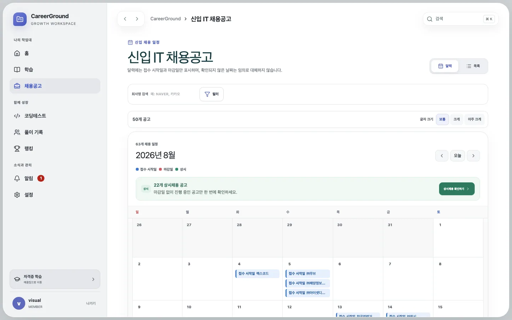
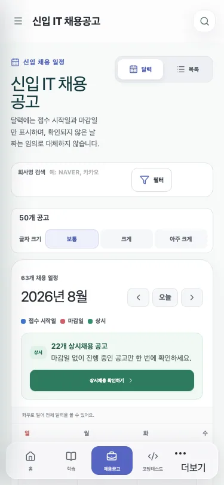

# 채용 달력 날짜 중복·회사 검색·Slack 요약 단일화

## 문제와 기준선

채용 달력은 같은 공고에 등록일, 접수 시작일, 마감일을 각각 일정으로 만들었다. 등록일과 접수 시작일이 같거나 가까우면 사용자는 같은 공고가 중복된 것으로 인식했고, 실제 지원 일정에 필요한 날짜보다 수집 메타데이터가 더 강하게 노출됐다. 회사명은 목록의 범용 검색어에 섞여 있었고 달력 화면에서는 전용 검색 입력이 보이지 않았다.

Slack 요약은 코딩 테스트와 채용 공고를 별도 webhook 요청으로 전송했다. 두 메시지가 다른 알림 사이에 분리될 수 있었고, 어느 날짜 기준인지 제목만으로는 바로 알기 어려웠다. 예약 시각도 평일 07:00 Asia/Seoul이었다.

변경 전 동일한 fixture와 runtime으로 채용 component 6/6, Slack formatter·sender 7/7 테스트가 통과했다. 이 기준선은 기존 동작을 정상 상태로 고정한 뒤 요구사항 변경을 적용하기 위한 것이다.

## 핵심 이론

달력은 데이터 원장의 모든 timestamp를 보여주는 표가 아니라 사용자의 행동 시점을 돕는 투영이다. `publishedAt`은 수집·등록 이력이고, `applicationStartAt`과 `deadlineAt`은 지원 행동을 결정하는 일정이다. 따라서 원본 데이터에서는 등록일을 유지하되 달력 event projection에서만 제외해야 목록·관리자 감사 정보와 지원 일정의 역할을 분리할 수 있다.

회사 검색은 서버 catalog를 다시 요청하는 대신 이미 받은 현재 결과에서 `company.name`만 NFKC 정규화하고 대소문자와 공백을 무시해 필터링한다. URL의 `company` query parameter에 상태를 보존하므로 목록과 달력 전환, 새로고침, 링크 공유에서도 같은 조건을 유지한다.

Slack Incoming Webhook의 메시지 경계는 HTTP 요청 경계다. 코딩과 채용을 하나의 Block Kit payload에 넣고 가운데 `divider`를 두면 하나의 알림 단위가 된다. 공고가 없을 때는 채용 block 전체를 생략하고 코딩 섹션만 유지한다.

## 변경 전후

| 항목                                    | 변경 전                       | 변경 후                                  |
| --------------------------------------- | ----------------------------- | ---------------------------------------- |
| 날짜가 있는 일반 공고의 달력 event 종류 | 최대 3개: 등록·접수 시작·마감 | 최대 2개: 접수 시작·마감                 |
| 등록일 달력 노출 경로                   | 2개: legend와 event 생성      | 0개                                      |
| 회사 전용 검색                          | 없음                          | 목록·달력 공통, URL 상태 유지            |
| 회사 검색 시 추가 catalog 요청          | 0회                           | 0회                                      |
| 채용 공고가 있는 Slack webhook POST     | 2회                           | 1회, 50% 감소                            |
| Slack 날짜 기준                         | 본문만으로 즉시 식별 어려움   | 최상단 `YYYY년 M월 D일 기준 새로운 알림` |
| Slack 섹션 구분                         | 메시지 자체가 분리            | 하나의 메시지 안 `divider` 1개           |
| 평일 예약 시각                          | 07:00 KST                     | 08:00 KST                                |

## 구현

달력 event type에서 `published`를 제거하고, 월 범위 판정과 event grouping도 접수 시작일·마감일·상시만 사용하도록 통일했다. 목록 카드와 상세에서는 등록일을 유지하므로 원본 메타데이터는 손실되지 않는다.

회사명 입력은 목록과 달력 상단에 같은 컨트롤로 표시한다. 입력은 350ms debounce 후 URL 상태에 반영하며, `company.name`에만 적용된다. 기존 범용 검색은 직무·기술 스택·지역 검색으로 역할을 좁혔다.

Slack formatter는 날짜를 검증한 뒤 한 payload만 만든다. 상단 날짜 header, 오늘의 코딩 테스트, 선택적 채용 공고, 서비스 링크 순서이며 코딩과 채용 사이에만 divider를 둔다. workflow cron은 timezone-aware schedule의 08:00으로 변경했고 주말·대한민국 공휴일 제외 규칙은 그대로 유지했다.

## 운영 데이터 확인

운영 D1을 읽기 전용으로 전체 페이지 조회한 결과 2026-08-21 기준 채용 공고 105건, 당일 `created_at` 31건을 확인했다. 그중 `ACTIVE`, 신입 지원 범위, 비상시, 마감일 명시 조건을 모두 만족해 Slack 신규 채용 대상이 되는 행은 15건이다. 운영 행 원문이나 자격증명은 증거 파일에 복사하지 않았고 schema 변경도 필요하지 않았다.

## 화면 검증

1440×900과 375×812에서 회사명 검색이 보이고, 달력 legend에는 접수 시작일·마감일·상시만 남는 것을 확인했다.

## 검증 결과

- 변경 후 채용 component: 6/6 통과
- 변경 후 Slack formatter·sender·schedule: 8/8 통과
- 전체 unit·component·runtime 테스트: 143/143 통과
- Playwright E2E: Chromium·모바일 Chromium·Firefox·WebKit 56/56 통과
- 달력 시각 회귀: Chromium 5/5 통과 후 1440×900·375×812 결과 직접 확인
- format, lint, typecheck, production build, Sites build 통과
- docs build의 기존 500 kB 초과 chunk 경고는 종료 코드가 성공이며 이번 변경과 무관하다.

회사 검색 테스트는 입력 전후 catalog fetch가 1회로 유지되는지, Slack 테스트는 공고 유무와 관계없이 반환 메시지가 1개인지, workflow 테스트는 `08:00`이면서 `07:00`이 아닌지를 회귀 조건으로 고정한다. 동일한 운영 전후 지연 표본은 수집하지 않았으므로 검색 체감 속도나 Slack 전달 지연 개선율은 **정량 측정 불가**다.
