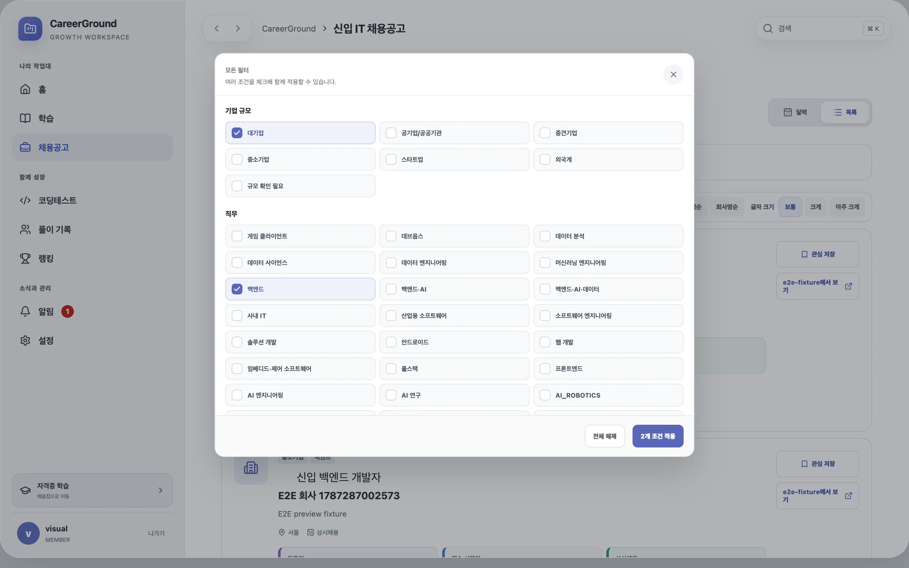
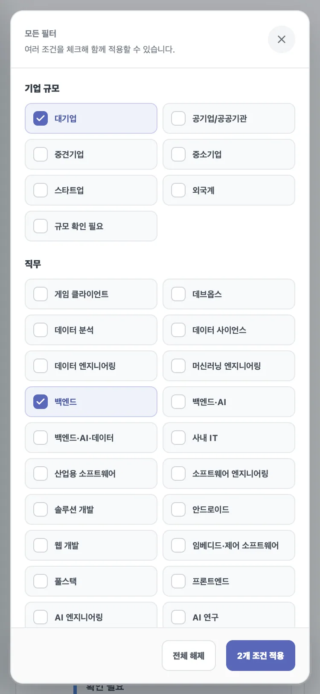

# 채용 복수 필터 체크 아이콘 정렬

## 문제와 기준선

채용 필터의 선택 표시는 17×17px 컨테이너 안에 Lucide `Check` 아이콘을 넣었지만, 아이콘의 높이와 행 높이를 명시하지 않았다. 브라우저가 SVG의 기본 크기와 인라인 행 상자를 함께 계산하면서 체크가 선택 박스의 중앙보다 치우쳐 보였다. 수정 전 동일한 코드에서 Chromium 시각 회귀 5/5가 통과하는 기준선을 먼저 남겼다.

## 핵심 이론

SVG를 시각적으로 중앙에 놓으려면 부모의 정렬 방식만으로는 충분하지 않다. 아이콘 자체의 가로·세로 크기, 인라인 행 높이, flex 축소 여부를 함께 고정해야 브라우저와 viewport가 달라도 같은 기하가 유지된다. 그래서 부모는 `inline-flex`와 양축 중앙 정렬을 사용하고 `line-height: 0`으로 글자 행 상자의 영향을 제거했다. SVG는 12×12px block으로 고정하고 Lucide 선 굵기를 3으로 지정했다.

## 변경 전후

| 항목               | 변경 전                | 변경 후                        |
| ------------------ | ---------------------- | ------------------------------ |
| 체크 컨테이너 정렬 | `grid` + `place-items` | `inline-flex` + 양축 중앙 정렬 |
| SVG 크기           | 너비 11px, 높이 미지정 | 너비·높이 12px                 |
| 행 높이            | 상속                   | 0px                            |
| 아이콘 선 굵기     | 라이브러리 기본값      | 3                              |
| 회귀 불변식        | 없음                   | 중심 오차 X/Y 각각 0.5px 이하  |

수정 전 중심 오차를 별도 수치로 보존하지 않았으므로 개선량 자체는 **정량 측정 불가**다. 변경 후에는 데스크톱 1440×900과 모바일 375×812에서 아이콘 중심과 컨테이너 중심의 차이가 각 축 0.5px 이하이고, 실제 SVG가 12×12px인지 자동 검증한다.

## 화면 검증

## 검증 결과

- format, lint, typecheck 통과
- unit·component·runtime 테스트 143/143 통과
- Playwright E2E 56/56 통과: Chromium, 모바일 Chromium, Firefox, WebKit
- 프로덕션 빌드와 Sites 빌드 통과
- 성능 예산 실패 0건

프로덕션 빌드의 문서 사이트 번들 크기 경고는 종료 코드가 성공인 기존 비차단 경고이며 이 CSS 변경과 무관하다.
