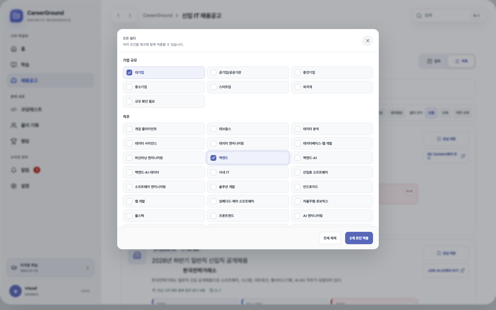
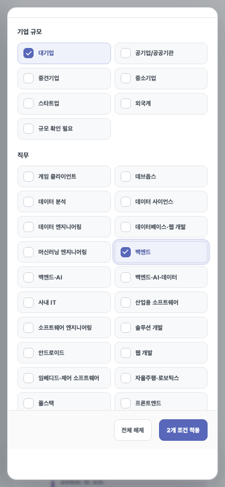

# 채용 직무 필터 한글 통합

## 문제와 기준선

운영 D1의 활성 채용공고 83개를 같은 시점에 점검했다. 직무 원시 값은 40종이었고, 화면의 한글 변환표가 처리하지 못한 값은 14종이었다. `PUBLIC_ICT`, `AI_DATA_ENGINEERING` 같은 저장 코드가 그대로 필터가 되면서 기존 한글 직무와 영문 직무가 함께 보였다.

## 핵심 이론

저장 값과 표시 값은 역할이 다르다. DB의 직무 코드는 import와 데이터 대조를 위해 안정적으로 유지하고, UI 경계에서 사용자 언어로 정규화해야 한다. 여러 원시 코드가 같은 의미라면 표시 라벨을 먼저 변환한 뒤 `Set`으로 중복을 제거해야 필터의 개념 단위와 선택 상태가 일치한다.

알 수 없는 값을 그대로 fallback하면 다음 import에서 같은 문제가 다시 생긴다. 따라서 한글이 포함된 서술형 값은 보존하되, 매핑되지 않은 영문 값은 `기타 IT 직무`로 묶어 영문 내부 코드가 사용자 화면에 노출되지 않도록 했다.

## 변경 전후

| 항목                       |    변경 전 | 변경 후 |
| -------------------------- | ---------: | ------: |
| 활성 공고 원시 직무 값     |       40종 |    40종 |
| 미변환 영문 직무 코드      |       14종 |     0종 |
| 중복 제거된 한글 필터 옵션 | 측정 안 함 |    37종 |
| DB 원본 변경               |       없음 |    없음 |

`FULLSTACK`과 `FULL_STACK_DEVELOPMENT`, `ANDROID`와 `MOBILE_ANDROID`, `MULTI_IT_ROLE`과 `MULTI_IT_ROLES`처럼 같은 의미의 코드는 각각 하나의 한글 옵션으로 합쳐진다. 표시 문자열만 변환하므로 조회 속도 개선은 **정량 측정 불가**이며 별도 성능 향상을 주장하지 않는다.

## 화면 검증

1440×900과 375×812에서 모든 직무 필터 라벨에 한글이 포함되고 동일 라벨이 한 번만 나타나는지 자동 검증했다.

## 회귀 방지와 검증

- `BACKEND`와 `백엔드`가 한 개의 `백엔드` 체크박스로 합쳐지는지 component test로 확인
- `PUBLIC_ICT`가 `공공기관 IT`로 표시되는지 확인
- 미등록 `UNMAPPED_ROLE`이 영문 그대로 노출되지 않고 `기타 IT 직무`가 되는지 확인
- format, lint, typecheck 통과
- unit·component·runtime 테스트 145/145 통과
- Playwright E2E 56/56 통과: Chromium, 모바일 Chromium, Firefox, WebKit
- production build와 Sites build 통과

DB migration은 없으며 공고 원본 값은 수정하지 않았다.
