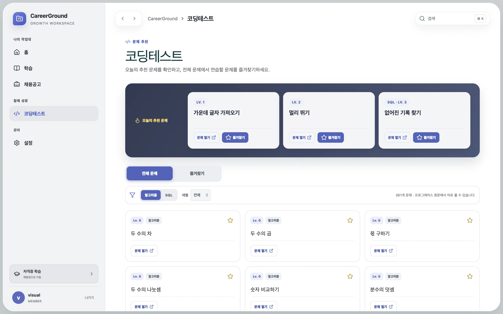
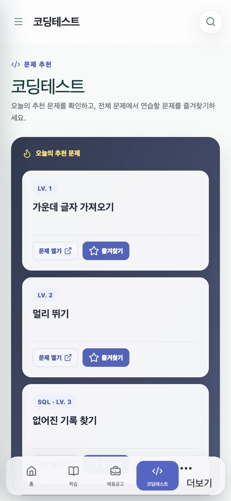

# 코딩테스트 카탈로그 단순화와 인앱 알림 제거

## 문제와 기준선

코딩테스트 영역이 추천과 문제 탐색이라는 핵심 목적 외에 풀이 작성, 공유 풀이, 댓글, 반응, 랭킹까지 한 화면 흐름에 묶여 있었다. 좌측 메뉴에는 코딩테스트와 별도로 풀이 기록, 랭킹, 알림이 노출됐고, 인증·채용·학습 bootstrap도 읽지 않은 인앱 알림 수를 함께 조회했다.

변경 전 회귀 기준은 코딩·풀이·랭킹 3개 화면 테스트 파일의 9개 테스트가 통과하는 상태였다. 이 기준을 보존한 채 사용자가 요청한 최소 기능을 새 테스트로 다시 정의했다.

## 핵심 이론

기능 제거는 메뉴를 숨기는 것만으로 끝나지 않는다. 사용자에게 보이는 진입점, 브라우저가 호출하는 계약, 서버가 제공하는 route, 백그라운드 producer를 함께 닫아야 기능이 다시 노출되거나 불필요한 DB 조회가 남지 않는다. 반면 이미 적용된 migration을 되돌리거나 운영 테이블을 즉시 삭제하면 배포 순서에 따라 장애와 데이터 손실을 만들 수 있다. 따라서 이번 변경은 활성 제품 표면을 제거하되 기존 테이블은 호환성 보존을 위해 그대로 두는 expand-and-contract 방식의 첫 단계로 처리했다.

## 변경 전후

| 항목                     | 변경 전                                           | 변경 후                                      |
| ------------------------ | ------------------------------------------------- | -------------------------------------------- |
| 코딩 관련 사용자 화면    | 코딩테스트·풀이 기록·랭킹 3개                     | 코딩테스트 1개                               |
| 코딩 화면 핵심 동작      | 풀이 편집·공유 풀이·댓글·반응·랭킹·진행 상태 포함 | 오늘의 추천 3개·전체 문제·즐겨찾기·원문 열기 |
| 인앱 알림 화면           | 메뉴와 전용 목록 제공                             | 메뉴 제거, 과거 URL은 홈으로 이동            |
| 활성 협업·인앱 알림 API  | 풀이·댓글·랭킹·알림 route 제공                    | 해당 route를 모두 `404 ROUTE_RETIRED`로 차단 |
| 정기 producer            | 공고 마감 인앱 알림 생성                          | 만료 세션·rate-limit 정리만 수행             |
| 클라이언트 editor 의존성 | CodeMirror와 5개 언어 package                     | 모두 제거                                    |

기존 URL `/solutions`와 `/rankings`는 `/coding`으로, `/notifications`는 홈으로 이동한다. 코딩 데이터 응답에서는 풀이 수와 해결 상태를 제거하고 즐겨찾기 상태만 반환한다. 홈 검색은 풀이 결과를 더 이상 만들지 않으며, SOLUTION 유형의 과거 컬렉션 항목도 화면에서 제외한다.

## 정량적 구조 개선

동일한 mock D1 계약 테스트에서 bootstrap query 수는 다음처럼 줄었다.

- 홈 bootstrap: 5회 → 4회
- 채용 bootstrap: 6회 → 5회
- 코딩 catalog bootstrap: 4회 → 3회
- 학습 bootstrap: 4회 → 3회

문제 목록과 상세 조회에서는 각 문제 행마다 수행되던 `solutions` 집계 상관 서브쿼리를 제거했다. 이는 쿼리 구조의 감소이며 운영 latency 개선율로 환산하지 않는다. 실제 운영 네트워크 측정값이 없으므로 응답 시간 개선 수치는 주장하지 않는다.

번들 예산 검사에서 초기 구성의 최대 JavaScript 청크가 gzip 122,414 bytes로 110,000 bytes 제한을 넘었다. React runtime과 데이터·폼 의존성을 독립 청크로 분리한 뒤 최대 청크는 gzip 71,660 bytes로 줄었고, 초기 route 전체는 gzip 145,083 bytes로 180,000 bytes 제한 안에 유지됐다. 이는 전송량 전체가 같은 비율로 감소했다는 의미가 아니라 캐시와 병렬 로딩을 위한 최대 청크 크기 개선이다.

## 화면 증거

## 회귀 방지

- 컴포넌트 테스트는 추천 3개, 전체 문제, 즐겨찾기 optimistic update와 SQL 분류를 확인한다.
- API 테스트는 즐겨찾기 PATCH가 계속 동작하고 풀이·댓글·랭킹·알림 route는 404가 되는지 확인한다.
- E2E는 1440×900과 375×812에서 추천·전체 목록·즐겨찾기를 캡처하고, 제거된 메뉴와 편집 UI가 없는지 확인한다.
- 과거 migration과 테이블은 삭제하지 않아 운영 DB 배포를 비파괴적으로 유지한다.

최종 로컬 검증에서 unit·integration 145개와 Chromium·Firefox·WebKit E2E 50개가 통과했다. 합성 성능 예산 검사는 채용 cursor p95 5.17ms, 코딩 문제 cursor p95 3.26ms, 즐겨찾기 p95 0.15ms, 검색 p95 29.53ms로 모두 통과했다. 이 수치는 로컬 D1 호환 SQLite 측정이며 운영 네트워크 latency로 해석하지 않는다. 복구 drill도 schema integrity, foreign key violation 0건, fixture checksum 일치로 통과했다.

재현 명령은 `pnpm test`, `pnpm test:e2e`, `pnpm typecheck`, `pnpm build`, `pnpm bundle:budget`, `pnpm performance:budget`, `pnpm recovery:drill`이다.
