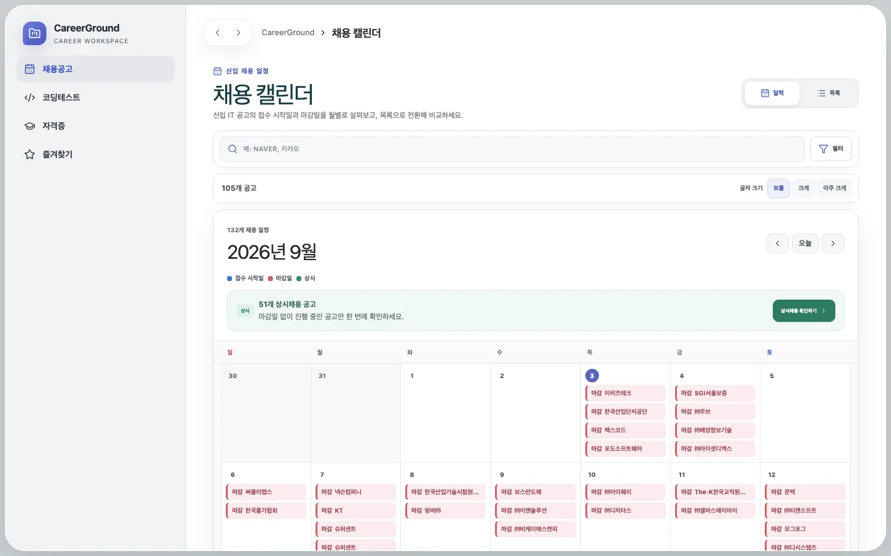
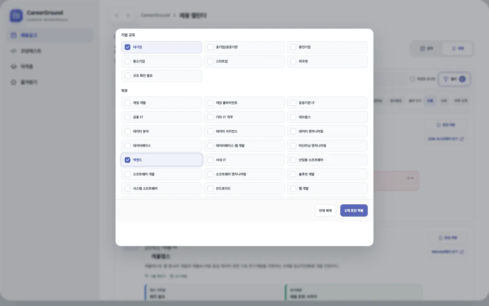
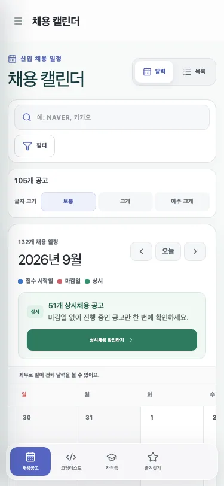

# 채용 달력 중심 홈과 제품 표면 단순화

## 문제와 기준선

기존 `/`는 즐겨찾기 요약이 중심이고 채용 달력은 `/jobs`에 분리되어 있었다. 좌측 탐색에는 홈·채용공고·학습·코딩테스트·자격증이 함께 노출됐고, 전역 검색과 홈 보기 방식도 별도 상태로 남아 있었다. 사용자가 가장 자주 확인하려는 채용 일정을 첫 화면에서 바로 파악하기 어렵고, 유지하려는 핵심 기능보다 제품 표면이 넓었다.

변경 전 기준선은 `a0ec627651273cba5bcc5dade08f53d18c7345f1`이며 같은 로컬 D1 fixture와 1440×900·375×812 viewport를 사용했다.

## 핵심 이론

정보 밀도가 높은 일정 화면은 요약 카드보다 시간축을 먼저 보여줘야 날짜 간 관계를 한 번에 비교할 수 있다. 반대로 모바일에서 7열을 화면 폭에 억지로 축소하면 회사명과 일정 종류가 읽히지 않는다. 따라서 데스크톱은 가용 작업 영역을 채우는 월간 그리드를 사용하고, 모바일은 달력의 최소 가독 폭을 유지한 채 달력 영역 안에서만 가로로 이동하도록 구성했다.

기능 제거는 링크만 숨기지 않고 route, preload, 전역 검색 의존성, 전용 컴포넌트와 테스트를 함께 정리했다. 이미 배포된 학습 DB migration과 데이터는 파괴하지 않고 보존하며 과거 URL만 안전하게 달력 홈으로 이동한다.

## 변경 전후

| 항목                  | 변경 전                      | 변경 후                                    |
| --------------------- | ---------------------------- | ------------------------------------------ |
| 첫 화면               | 즐겨찾기 요약 홈             | 월간 채용 달력                             |
| 채용 보기 방식        | 별도 `/jobs` 화면            | `/`에서 달력 기본·목록 전환                |
| 좌측 목적지           | 5개                          | 채용공고·코딩테스트·자격증·즐겨찾기 4개    |
| 활성 내부 페이지 모듈 | 4개                          | 채용·코딩·즐겨찾기 3개                     |
| 전역 검색             | 공고·문제·학습 통합 검색     | 제거, 채용 화면 안의 회사명·공고 검색 유지 |
| 학습 화면             | `/learning` 제공             | 제품 표면 제거, 과거 URL은 `/`로 이동      |
| 모바일 달력           | 별도 채용 화면의 축소 그리드 | 760px 가독 폭과 내부 가로 스크롤           |

달력에는 접수 시작일·마감일·상시를 구분하고, 혼잡한 날짜와 상시채용은 전용 모달로 연다. 목록 모드에서는 기존 회사명 검색, 공고 검색, 복수 회사 규모·직무 필터, 정렬, 글자 크기, 관심 공고 저장을 그대로 유지한다. `/jobs`의 검색 문자열도 `/`로 넘겨 기존 링크를 깨뜨리지 않는다.

## 화면 비교

변경 전 즐겨찾기 중심 홈:

변경 후 대형 채용 달력:

목록·복수 필터:

모바일 내부 스크롤:

## 검증 중 발견한 문제와 수정

첫 브라우저 접근성 검사에서 모바일 달력의 “좌우로 밀어” 안내가 8px, 대비 3.93:1로 확인돼 WCAG AA 최소 대비를 충족하지 못했다. 전경색을 더 어둡게 하고 9px·700 굵기로 조정한 뒤 Chromium 접근성 재검사에서 critical·serious·moderate 위반이 0건이 됐다.

필터 E2E는 조건을 해제한 직후 이전 필터 결과의 첫 카드를 잡아 DOM 교체 시점과 경쟁했다. URL의 회사 규모·직무 조건이 모두 제거되고 필터 칩이 0개가 될 때까지 기다리도록 사용자 관찰 가능 상태를 기준으로 동기화했다. 이후 Chromium·Firefox·WebKit에서 같은 시나리오가 통과했다.

## 회귀 방지와 결과

- contracts 10건, web 15건, 운영·배포 스크립트 253건이 모두 통과했다.
- Chromium·Firefox·WebKit과 375×812 Chromium 모바일 E2E 31건이 모두 통과했다.
- lint, typecheck, production build가 통과했다.
- 초기 route gzip은 124,731 bytes, 최대 JavaScript 청크는 71,662 bytes, 최대 CSS는 20,996 bytes로 저장소 예산 안이다.
- 로컬 성능 예산 실패 0건이며 운영 네트워크 latency 개선율로 해석하지 않는다.
- DB schema 변경과 Slack 전송은 각각 0건이다.

재현 명령은 `pnpm lint`, `pnpm typecheck`, `pnpm test`, `pnpm test:e2e`, `pnpm build`, `pnpm bundle:budget`, `pnpm performance:budget`이다. 구조화된 근거는 `docs/evidence/recruitment-calendar-home-2026-09-03.json`에 있다.
